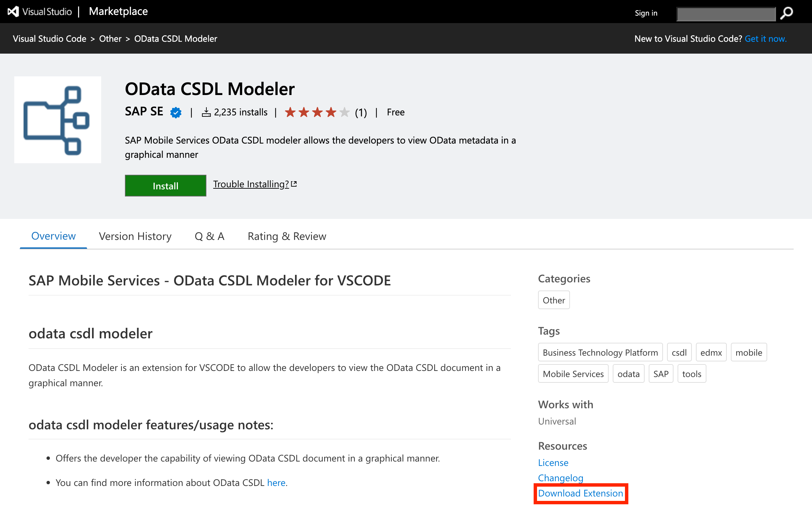
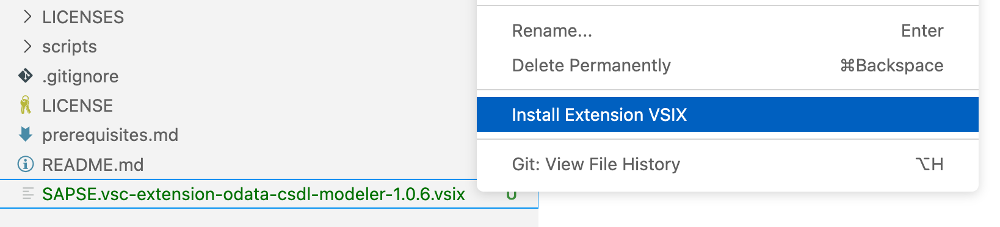
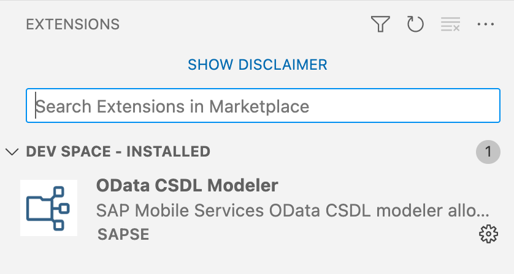

# Exercise 01 - Set up your workspace

At the end of this exercise, you'll have an environment in which to work for the duration of this CodeJam, and the contents of this repository loaded and ready to use

## Set up the environment and clone this repository

To have the building blocks for this CodeJam ready to use, you'll need to clone this CodeJam repository and have the contents available in the workspace that you chose in the [prerequisites](../../prerequisites.md). Your workspace is either going to be a Dev Space in the SAP Business Application Studio (the "primary environment"), or VS Code with a dev container (the "alternative environment").

Follow one of the two subsections here, as appropriate: either for a [primary environment](#primary-environment-a-dev-space-in-the-sap-business-application-studio) or for an [alternative environment](#alternative-environment-vs-code-and-a-container-image).

### Primary environment: A Dev Space in the SAP Business Application Studio

_Follow the "Alternative environment" subsection below if you want to use VS Code and a container image._

#### Create a Dev Space

👉 Via your subscription to the SAP Business Application Studio, create a new Dev Space, choosing the "Full Stack Cloud Application" type, and then make sure it's started up:


Choosing the "Full Stack Cloud Application" brings in some predefined extensions, as you can see from the screenshot, including a CDS Graphical Modeler and the CAP Tools. 

> You may need to stop existing Dev Spaces to use this one, depending on your subscription access.

#### Clone this repository

👉 Once the Dev Space is started and you're in it, use the "Clone from Git" option in the "Get Started" screen that appears, to clone this repository, following the subsequent prompts to open the cloned repository (at which point your Dev Space will restart):


#### Manually install the OData CSDL Modeler extension

The final step to set up your Dev Space for the CodeJam is to manually install another extension, which is not yet available as standard in any Dev Space type. This is the [OData CSDL Modeler](https://marketplace.visualstudio.com/items?itemName=SAPSE.vsc-extension-odata-csdl-modeler), which is similar to the CDS Graphical Modeler extension, except that instead of displaying CDS definitions in a graphical representation, it can display OData definitions (EDMX metadata files) in a graphical representation.

> The "Extensions" perspective in the SAP Business Application Studio's Dev Spaces can be used to install extensions comfortably, but only those available on the [Open VSX Registry](https://open-vsx.org/). The OData CSDL Modeler extension is currently only available on the official Microsoft Visual Studio Marketplace.

👉 Go to the [OData CSDL Modeler](https://marketplace.visualstudio.com/items?itemName=SAPSE.vsc-extension-odata-csdl-modeler) page in the Microsoft Visual Studio Marketplace and download it with the "Download Extension" facility as highlighted here:



👉 Once the file is available on your local machine, drag it to the Dev Space's "Explorer" perspective window to upload it to your Dev Space. Then, use the context menu on the file and choose "Install Extension VSIX":



> Once installed, you can safely delete the file from the Explorer.

You can check that the extension is indeed installed, by selecting the "Extensions" perspective, where you'll see it listed:



### Alternative environment: VS Code and a container image

_Follow the "Primary environment" section above if you want to use a Dev Space in the SAP Business Application Studio._

👉 At a command prompt on your local machine, clone this repository into a directory of your choice, and then open VS Code, pointing to that newly cloned repository's directory:

```bash
git clone https://github.com/SAP-samples/cap-service-integration-codejam
code cap-service-integration-codejam
```

Once VS Code has started, and opened the directory, it should notice the [dev container configuration file](../../.devcontainer/devcontainer.json) (in the [.devcontainer/](../../.devcontainer/) directory) and ask you if you want to reopen everything in a container, as shown in the screenshot. Confirm that you want to, by selecting the default answer "Reopen in Container". 


At this stage, once VS Code has reopened, you should be all set. You are ready to explore service integration with CAP in your dev container.

> In case you noticed the manual installation step for the OData CSDL Modeler extension in the context of using a Dev Space (the primary environment instructions), and were wondering why there's no equivalent step here, it's because the extension identifier (`sapse.vsc-extension-odata-csdl-modeler`) is included in the [devcontainer.json](../../.devcontainer/devcontainer.json) file in the list of extensions to install into the dev container. Nice!

## Check the installation of the CDS development kit

_This and subsequent steps apply to both the primary and alternative environments._

👉 Open a terminal, using "Terminal: Create New Terminal" in the Command Palette, and at the prompt, check the version:

```bash
cds v
```

You should see that the CDS development kit is installed. Depending on your workspace, you'll see slightly different output, but it should generally look something like this:

```text
@sap/cds: 6.4.1
@sap/cds-compiler: 3.5.4
@sap/cds-dk: 6.4.1
@sap/cds-dk (global): 6.4.1
@sap/cds-foss: 4.0.0
@sap/cds-mtx: -- missing --
@sap/cds-mtxs: 1.4.4
@sap/eslint-plugin-cds: 2.6.0
Node.js: v18.13.0
home: /usr/local/share/npm-global/lib/node_modules/@sap/cds-dk/node_modules/@sap/cds-dk
```

> The CDS development kit is installed as part of any "Full Stack Cloud Application" type of Dev Space in the SAP Business Application Studio, and for the alternative environment there's a RUN command in the [Dockerfile](../../.devcontainer/Dockerfile) that installs it into the dev container.

## Summary

At this point you've got an environment in which to work through the rest of the exercises in this CodeJam, you've got the contents of the repository, and you have the CDS development kit installed and ready to use.

## Further reading

* [Developing inside a Container](https://code.visualstudio.com/docs/devcontainers/containers)
* [Cloning repositories](https://help.sap.com/docs/SAP%20Business%20Application%20Studio/9d1db9835307451daa8c930fbd9ab264/7a68bfa7111b44f6b1e78b51e803238c.html) in SAP Business Application Studio
* [The @sap/cds-dk package on NPM](https://www.npmjs.com/package/@sap/cds-dk)

---

## Questions

If you finish earlier than your fellow participants, you might like to ponder these questions. There isn't always a single correct answer and there are no prizes - they're just to give you something else to think about.

1. What are the advantages of using container images for development work? 
1. What is the difference between the `@sap/cds` and `@sap/cds-dk` packages?

---

[Next exercise](../02-explore-basic-service/)
