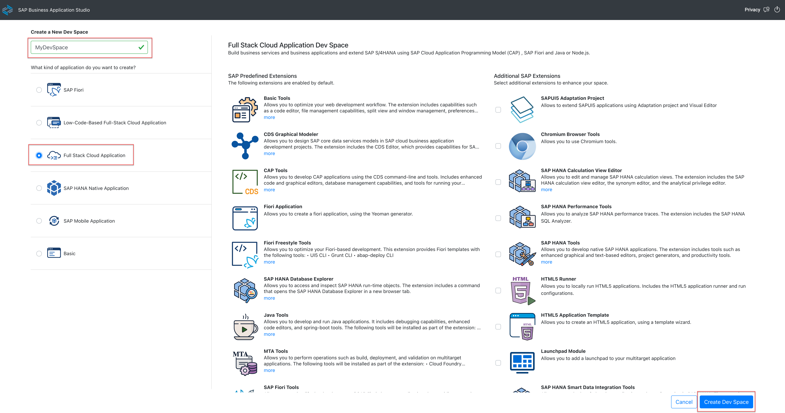
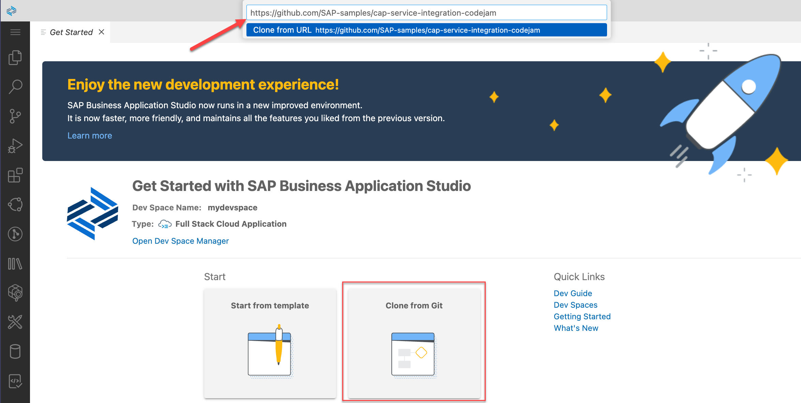

# Exercise 01 - Set up your workspace

At the end of this exercise, you'll have an environment in which to work for the duration of this CodeJam, and the contents of this repository loaded and ready to use.

## Set up the environment and clone this repository

To have the building blocks for this CodeJam ready to use, you'll need to clone this CodeJam repository and have the contents available in the workspace that you chose in the [prerequisites](../../prerequisites.md). Your workspace is either going to be a Dev Space in the SAP Business Application Studio (the "primary environment"), or VS Code with a dev container (the "alternative environment").

Follow one of the two subsections here, as appropriate: either for a [primary environment](#primary-environment-a-dev-space-in-the-sap-business-application-studio) or for an [alternative environment](#alternative-environment-vs-code-and-a-container-image).

### Primary environment: A Dev Space in the SAP Business Application Studio

_Follow the "Alternative environment" subsection below if you want to use VS Code and a container image._

#### Create a Dev Space

👉 Via your subscription to the SAP Business Application Studio, create a new Dev Space, choosing the "Full Stack Cloud Application" type, and then make sure it's started up:



Choosing the "Full Stack Cloud Application" brings in some predefined extensions, as you can see from the screenshot, including a CDS Graphical Modeler and the CAP Tools.

> You may need to stop existing Dev Spaces to use this one, depending on your subscription access.

#### Clone this repository

👉 Once the Dev Space is started and you're in it, use the "Clone from Git" option in the "Get Started" screen that appears, to clone this repository, following the subsequent prompts to open the cloned repository; specify `https://github.com/SAP-samples/cap-service-integration-codejam` as the URL.



At this point your Dev Space will restart.

### Alternative environment: VS Code and a container image

_Follow the "Primary environment" section above if you want to use a Dev Space in the SAP Business Application Studio._

👉 At a command prompt on your local machine, clone this repository into a directory of your choice, and then open VS Code, pointing to that newly cloned repository's directory:

```bash
git clone https://github.com/SAP-samples/cap-service-integration-codejam
code cap-service-integration-codejam
```

Once VS Code has started, and opened the directory, it should notice the [dev container configuration file](../../.devcontainer/devcontainer.json) (in the [.devcontainer/](../../.devcontainer/) directory) and ask you if you want to reopen everything in a container, as shown in the screenshot. Confirm that you want to, by selecting the default answer "Reopen in Container".

> If this doesn't happen, check that you have the Dev Containers extension in VS Code - see the [corresponding prerequisites section](../../prerequisites.md#alternative-environment-vs-code-with-a-dev-container) section for details. You might also need to explicitly request this action, by opening the Command Palette and selecting "Dev Containers: Reopen in container".


At this stage, once VS Code has reopened, you need to do one more thing, so that both primary and alternative environments are aligned (and so that the instructions in this CodeJam content don't need to differ between them).

* When you use the "git clone" facility in a _Dev Space_, the repo is cloned into a directory called `projects/`, which itself lives in the home directory of your user (`/home/user/`); in other words, it gets cloned to `/home/user/projects/<the-repo>`.
* In the _VS Code dev container_ the default username is `node` (not `user`) and the equivalent repo will be in `/workspaces/<the-repo>`. So let's align the repo location in your VS Code dev container environment to the Dev Space one.

A `/home/node/projects/` directory has already been created for you in the container image.

👉 Create a symbolic link in the `/home/node/projects/` directory to point to the repo:

```shell
ln -s /workspaces/cap-service-integration-codejam/ $HOME/projects/ \
  && cd $HOME/projects/cap-service-integration-codejam/
```

You can make sure that everything is OK by checking that you can see the directories inside the repo, via this new `projects/` directory in your dev container user's home directory. Here's an example, with what you might expect to see:

```shell
$ find -L $HOME/projects -maxdepth 2 -type d
/home/node/projects
/home/node/projects/cap-service-integration-codejam
/home/node/projects/cap-service-integration-codejam/.devcontainer
/home/node/projects/cap-service-integration-codejam/.git
/home/node/projects/cap-service-integration-codejam/.github
/home/node/projects/cap-service-integration-codejam/.reuse
/home/node/projects/cap-service-integration-codejam/.vscode
/home/node/projects/cap-service-integration-codejam/LICENSES
/home/node/projects/cap-service-integration-codejam/assets
/home/node/projects/cap-service-integration-codejam/exercises
/home/node/projects/cap-service-integration-codejam/incidents
/home/node/projects/cap-service-integration-codejam/scripts
```

Now you should be all set. You are ready to explore service integration with CAP in your dev container.

## Check the installation of the CDS development kit

_This and subsequent steps apply to both the primary and alternative environments._

👉 Inside your dev container or your Dev Space, open a terminal, using "Terminal: Create New Terminal" in the Command Palette, and at the prompt, check the version:

```bash
cds v
```

You should see that the CDS development kit is installed. Depending on your workspace, you'll see slightly different output, but it should generally look something like this:

```text
@cap-js/cds-types: 0.2.0
@sap/cds: 7.6.1
@sap/cds-compiler: 4.4.4
@sap/cds-dk: 7.5.1
@sap/cds-dk (global): 7.5.1
@sap/cds-fiori: 1.2.2
@sap/cds-foss: 5.0.0
@sap/cds-mtxs: 1.15.0
@sap/eslint-plugin-cds: 2.6.5
Node.js: v18.14.2
home: /managed-content/globals/pnpm/5/.pnpm/@sap+cds@7.6.1_express@4.18.2/node_modules/@sap/cds
```

> The CDS development kit is installed as part of any "Full Stack Cloud Application" type of Dev Space in the SAP Business Application Studio, and for the alternative environment there's a RUN command in the [Dockerfile](../../.devcontainer/Dockerfile) that installs it into the dev container.

## Install the NPM package dependencies

We'll be working mostly within the `incidents/` directory of this repo, which contains a simple starter CAP project. In there, the `package.json` file contains runtime and design time dependencies.

👉 Make sure you're in the `incidents/` directory (where `package.json` lives):

```bash
cd $HOME/projects/cap-service-integration-codejam/incidents/
```

👉 Now install the dependencies thus:

```bash
npm install
```

You can double check what's installed, with `npm list`, which should show you something similar to this:

```text
@acme/incidents-mgmt@1.0.0 /home/user/projects/cap-service-integration-codejam/incidents
├── @cap-js/sqlite@1.4.0
├── @sap/cds@7.5.3
└── express@4.18.2
```

## Summary

At this point you've got an environment in which to work through the rest of the exercises in this CodeJam, you've got the contents of the repository, and you have the CDS development kit installed and ready to use.

## Further reading

* [Developing CAP in containers - three ways](https://qmacro.org/blog/posts/2024/01/15/developing-cap-in-containers-three-ways/)
* [Developing inside a Container](https://code.visualstudio.com/docs/devcontainers/containers)
* [Cloning repositories](https://help.sap.com/docs/SAP%20Business%20Application%20Studio/9d1db9835307451daa8c930fbd9ab264/7a68bfa7111b44f6b1e78b51e803238c.html) in SAP Business Application Studio
* [The @sap/cds-dk package on NPM](https://www.npmjs.com/package/@sap/cds-dk)

---

## Questions

If you finish earlier than your fellow participants, you might like to ponder these questions. There isn't always a single correct answer and there are no prizes - they're just to give you something else to think about.

1. What are the advantages of using container images for development work?
1. What is the difference between the `@sap/cds` and `@sap/cds-dk` packages?

---

[Next exercise](../02-explore-basic-service/)
