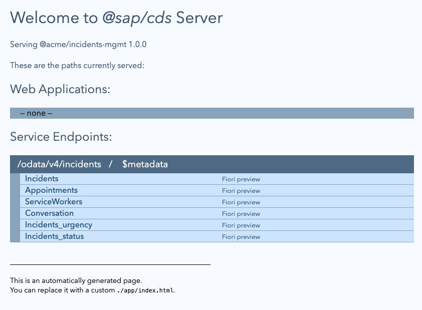

# Exercise 02 - Explore the basic service

As you saw at the end of the previous exercise, there's a basic "Incidents Management" service that's supplied. This will be the starter for your explorations. Think of it as your "local" service. It's in the [incidents/](../../incidents/) directory. At the end of this exercise, you'll feel comfortable with what that service offers, and have explored its components.

> All activities in this and subsequent exercises, unless otherwise stated, will be in the context of this `incidents/` directory (which you are already likely to be in, in your current terminal session, following the end of the previous exercise).

## Take a quick tour of the service

The service deals with incidents that are raised and discussed, and that are ultimately resolved by service worker personnel attending appointments to address and repair whatever is needed.

As a classic CAP based service, the core components are to be found within the lower two of the three normal organizational layers, which are presented here in an order that represents how one would normally view the layers of an application in general:

|Organizational Layer|Directory|Content|
|-|-|-|
|Application|`app/`|Very little, as this is a "headless" service, although some annotations are provided at this layer (in [fiori.cds](../../incidents/app/fiori.cds)) to augment the SAP Fiori elements frontend pages which CAP provides out of the box.|
|Service|`srv/`|The single service, defined in [incidents-service.cds](../../incidents/srv/incidents-service.cds), exposing entities from the persistence layer below, in a lightweight and fairly "transparent" way.|
|Persistence|`db/`|The actual entity definitions complete with property details, relationships, supporting artifacts such as enumerations, and even some basic annotations, defined in [schema.cds](../../incidents/db/schema.cds) (there are CSV files providing some sample data for each entity at this layer too).|

👉 Take a few moments to look through these directories and become familiar with their contents.

While it's important to feel comfortable reading and writing declaratively in CDS's definition language CDL, it also doesn't hurt to use an editor extension to view the same information graphically sometimes too.

> See the link in [Further reading](#further-reading) below for more information on CDL.

### Examine the schema at the persistence layer

👉 In your workspace, find the `db/schema.cds` file and use the context menu item "Open With...", selecting the "CDS Graphical Modeler" item in the selection presented to you:


You will be presented with a graphical model representing the details in `db/schema.cds`, looking something like this:


You may have to use this button to reveal the property sheet on the right:


👉 Take a few moments to [stare](https://qmacro.org/blog/posts/2017/02/19/the-beauty-of-recursion-and-list-machinery/#initialrecognition) at this to see what reveals itself. Here are few pointers to what's available here:

* on the right hand side various components and properties are listed, including imports, entities and so on
* in the main graphical display there are entities, such as `Incidents` and `ServiceWorkers` (note the icon denoting entities)
* the `Incidents` entity is further decorated with the `cuid` and `managed` aspects
* there are relationships shown between the entities, such as the one-to-many relationship between `ServiceWorkers` and `Appointments`
* the enumerations (enums) are used to provide possible values for certain properties (such as for `urgency` and `status`)
* the main namespace is `acme.incmgt` but there are also namespaces from the imported items (via the CDS `using` statement at the beginning of `db/schema.cds`)

    

👉 Try to relate what you have discovered in this graphical display to the definitions in the `db/schema.cds` file.

### Examine the service definition at the service layer

Now it's time to move up a layer, from persistence to service.

👉 Find the `srv/incidents.cds` file, and open it with the CDS Graphical Modeler. Like before, take a few moments to stare at the graphical representation of the service layer; here are some pointers to what you should notice:

* this time the main namespace is `IncidentsService` and there are imported namespaces too
* in contrast to the entities shown in the graphical display of `db/schema.cds` we now see projections (note the icon is different from the one that represented entities previously)
* there isn't a one-to-one mapping of projections to all entities
* but where there is a mapping, there's a one-to-one property correlation (i.e. all the properties at the persistence layer are available at this service layer)

### Run the service

Now you feel more familiar with the baseline service for this CodeJam, why not start it up?

👉 Make sure you're in the `incidents/` directory and start things up like this:

```bash
cds watch
```

👉 Observe how the service starts up, and examine the messages emitted. They should be similar to this:

```text
cds serve all --with-mocks --in-memory?
watching: cds,csn,csv,ts,mjs,cjs,js,json,properties,edmx,xml,env,css,gif,html,jpg,png,svg...
live reload enabled for browsers

        ___________________________


[cds] - loaded model from 4 file(s):

  db/schema.cds
  srv/incidents-service.cds
  app/fiori.cds
  ../../../usr/local/share/npm-global/lib/node_modules/@sap/cds-dk/node_modules/@sap/cds/common.cds

[cds] - connect using bindings from: { registry: '~/.cds-services.json' }
[cds] - connect to db > sqlite { url: ':memory:' }
 > init from db/data/acme.incmgt-Appointments.csv
 > init from db/data/acme.incmgt-Incidents.conversation.csv
 > init from db/data/acme.incmgt-Incidents.csv
 > init from db/data/acme.incmgt-Incidents_status.csv
 > init from db/data/acme.incmgt-Incidents_urgency.csv
 > init from db/data/acme.incmgt-Incidents_urgency.texts.csv
 > init from db/data/acme.incmgt-ServiceWorkers.csv
 > init from db/data/acme.incmgt-TeamCalendar.csv
/> successfully deployed to sqlite in-memory db

[cds] - serving IncidentsService { path: '/incidents', impl: 'srv/incidents-service.js' }

[cds] - server listening on { url: 'http://localhost:4004' }
[cds] - launched at 1/27/2023, 1:47:49 PM, version: 6.4.1, in: 1.355s
[cds] - [ terminate with ^C ]
```

Unless you've turned this type of notification off in your workspace settings, you should see a message appear in your workspace to the effect that port 4004 is open and available; here's an example from VS Code:


Here's the equivalent message from a Dev Space in the SAP Business Application Studio:


👉 Open <http://localhost:4004> in your browser, and examine the resources available. You should see something similar to this:



While this is not unexpected, take a moment to consider what else is evident from the content of this generated web page, beyond the list of entities with links to the corresponding entity set resources and Fiori preview apps:

* There are no "Web Applications" as this is a headless service (and we have very little in the Application layer, certainly not any HTML)
* There are endpoints for just a single service, and that service is represented by the service prefix `/incidents`, which just happens also to be the path to the corresponding OData service document (at <http://localhost:4004/incidents>), just as `/incidents/$metadata` happens to be the path to the metadata document of the service (at <http://localhost:4004/incidents/$metadata>)

## Summary

At this point you've examined and started up the base CAP service that you'll be working with and extending in this CodeJam. If you were to sketch a simple entity relationship diagram it would look something like this:

```text
┌────────────────┐       ┌────────────────┐
│                │*     1│                │
│ Conversations  ├───────┤   Incidents    │
│                │       │                │
└────────────────┘       └───────┬────────┘
                                 │
                                 │
                                1│
                         ┌───────┴────────┐
                         │                │
                         │  Appointments  │
                         │                │
                         └───────┬────────┘
                                *│
                                 │
                                1│
                         ┌───────┴────────┐
                         │                │
                         │ ServiceWorkers │
                         │                │
                         └────────────────┘
```

## Further reading

* CDS [Definition Language (CDL)](https://cap.cloud.sap/docs/cds/cdl)
* [Domain Modeling with CDS](https://cap.cloud.sap/docs/guides/domain-models)
* [An introduction to CDS Graphical Modeler for SAP Business Application Studio](https://blogs.sap.com/2021/04/23/an-introduction-to-cds-graphical-modeler-for-sap-business-application-studio/)

---

## Questions

If you finish earlier than your fellow participants, you might like to ponder these questions. There isn't always a single correct answer and there are no prizes - they're just to give you something else to think about.

1. While there are two imported namespaces shown when examining the `db/schema.cds` contents (`global` and `sap.common`), there are three shown when examining the `srv/incidents-service.cds` contents. What is the third, and where does that come from?

1. In looking at the graphical display of the `srv/incidents-service.cds` contents, one of the entities (from the `db/schema.cds` layer) wasn't shown. Which one, and why?

1. There's a lot to unpack from the initial output of `cds watch`. What does the output tell you?

1. `cds watch` is actually just a shortcut for another `cds` command. What is it?

1. In the "Welcome to @sap/cds Server" landing page at <http://localhost:4004>, where do the details `Serving @acme/incidents-mgmt 1.0.0` come from?

---

[Next exercise](../03-import-odata-api/)
