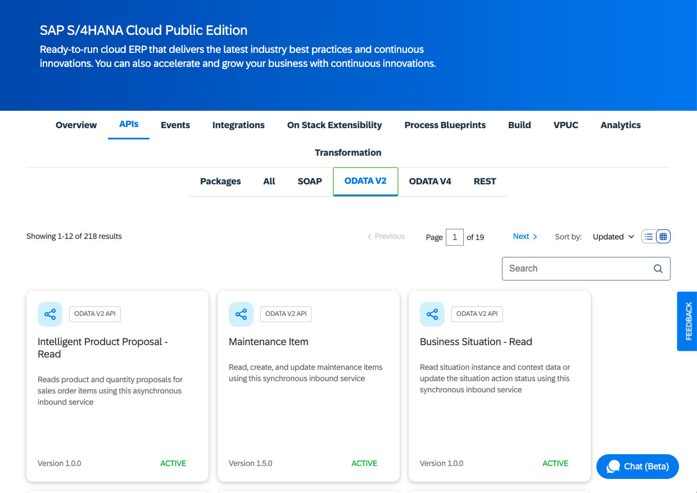

# Exercise 03 - Import an OData service definition

At the end of this exercise, you'll be familiar with discovering & exploring SAP APIs, also known as service definitions. These service definitions are required to use remote services in CAP (e.g. to call a remote service, build projections upon them, and so on). Also by the end of this exercise you'll have imported the service definition into your CAP project and have seen what that brings, specifically an entity type that we'll use for an additional "customer" entity in our existing service.

## Stop the execution of the basic service

`cds watch` does some magical things if it discovers the change or creation of files in its purview, but for now we want to keep things simple and take things step by step, so we don't want it to do that for us, for now.

👉 If you still have the `cds watch` process running, stop it, with Ctrl-C.

## Find and examine the Business Partner API

The [SAP Business Accelerator Hub](https://api.sap.com) is where service definitions for APIs associated with its major products are published.

### Find it in the SAP Business Accelerator Hub

👉 Go to the [SAP Business Accelerator Hub](https://api.sap.com) and find the [SAP S/4HANA Cloud Public Edition "Business Partner (A2X)" API](https://api.sap.com/api/API_BUSINESS_PARTNER/overview); you can take whichever route you like, here's just a suggestion:

1. Opt to explore "SAP S/4HANA Cloud Public Edition" under the "Products" category
1. Then select the "APIs" category and narrow the content down by selecting the "ODATA V2" subcategory
    
1. Finally, page through the search results, or, using the "Search" field, look for "business partner", to find the Business Partner (A2X) API

👉 Once you've found it, select it and take a moment to look at the initial details; feel free to explore anything you wish.


### Examine the Business Partner group of API endpoints

👉 While exploring, make sure you notice that there are many endpoints to this API, collected together into groups. Go to the [API Reference](https://api.sap.com/api/API_BUSINESS_PARTNER/resource) section and you'll see endpoints organized into groups which are listed down the left side. Find and select the "Business Partner" group and look at the endpoints in that group, and what HTTP methods are available on each endpoint.

> It's specifically the "Business Partner" area within the wider Business Partner (A2X) API that we'll be digging deeper into in this CodeJam.

👉 Within the "Business Partner" group, identify and expand the first endpoint in the list, which is the `GET /A_BusinessPartner` endpoint. Scroll down to the "Responses" section for this entry and make sure the "Example Value" is selected, which should look like this, showing a typical OData V2 JSON response (with the [tell-tale `d` property](https://www.odata.org/documentation/odata-version-2-0/json-format/#:~:text=The%20name%20of%20the%20name,but%20not%20valid%20JavaScript%20statements.)):


👉 Switch from the "Example Value" to the "Schema" for the response, and note that the schema is essentially a collection of entities of the type `A_BusinessPartnerType`. Remember this as it will be relevant very shortly:


### Understand how we will use the business partner as customer

We'll be using the generic "Business Partner" concept to be the basis for a further entity in our service, specifically to represent customers (who create incidents).

👉 Look at this updated entity relationship diagram, and note where we will introduce business partners as `Customers`:

```text
┌────────────────┐       ┌────────────────┐       ┌────────────────┐
│                │*     1│                │*     1│                │
│ Conversations  ├───────┤   Incidents    ├───────┤   Customers    │
│                │       │                │       │                │
└────────────────┘       └───────┬────────┘       └────────────────┘
                                 │
                                 │
                                1│
                         ┌───────┴────────┐
                         │                │
                         │  Appointments  │
                         │                │
                         └───────┬────────┘
                                *│
                                 │
                                1│
                         ┌───────┴────────┐
                         │                │
                         │ ServiceWorkers │
                         │                │
                         └────────────────┘
```

## Download and study the API specification

Each API has a machine-readable specification. More than one, in fact. To incorporate such an API into a CAP project, such a specification is needed.

👉 In the API's [Overview](https://api.sap.com/api/API_BUSINESS_PARTNER/overview) section, select the "API Specification" from the "API Resources" area, and download the EDMX specification to a directory on your local machine. The file should be called `API_BUSINESS_PARTNER.edmx`.

> You need to be logged on to the SAP Business Accelerator Hub to download specifications.

👉 Now copy the `API_BUSINESS_PARTNER.edmx` file to your workspace, taking care to copy it specifically into the `incidents/` directory within the workspace.

> You can drag files and drop them into the Explorer perspective in either type of workspace - an SAP Business Application Studio Dev Space or VS Code with container image. In the case of VS Code with a container image, you can also simply copy the file into the cloned repository directory on your locally machine ... and it will become automatically available in the context of the running container image.

👉 Once you have the file in your workspace, take a quick look at it.

The contents aren't particularly human-readable, not easily anyway, but in the wall of text and angle brackets you may notice some aspects that might be familiar to you. Yes, it's an OData metadata document for the API!

👉 Use the context menu on the filename to select the "Open With..." menu item, and choose the "OData CSDL Modeler". If the "General" view is showing as default, select the setting and change it to "Diagram".

You should be presented with a graphical display of the contents of the EDMX file, in a very similar way to how you saw graphical displays of the basic CAP project's `db/schema.cds` and `srv/incidents-service.cds` files in [exercise 02](../02-explore-basic-service/). This is the sort of thing that you should see:


While the graphical depiction of each of the CAP project components was quite simple, reflecting the simplicity of the basic CAP project, this graphical depiction is considerably more complex.

👉 Within the OData CSDL Modeler, use the search facility or the list of entity types in the side bar on the right to find the `A_BusinessPartnerType` entity definition. This is the type that we saw earlier when looking at the schema view for the response to the `GET /A_BusinessPartner` HTTP method + endpoint combination.

A large entity should present itself, with many relationships to other entities. It's this entity from which we'll be adopting properties into our service, specifically `BusinessPartner` (the key property) and `BusinessPartnerFullName`.

## Import the API specification

Now you have the `API_BUSINESS_PARTNER.edmx` file in the `incidents/` directory within your workspace, and you've briefly examined the contents, it's time to import it.

👉 In the `incidents/` directory, execute this:

```bash
cds import API_BUSINESS_PARTNER.edmx
```

You should see some log output that looks like this:

```log
[cds] - updated ./package.json

[cds] - imported API to srv/external/API_BUSINESS_PARTNER
> use it in your CDS models through the like of:

using { API_BUSINESS_PARTNER as external } from './external/API_BUSINESS_PARTNER'
```

In addition, a few things should happen:

* a new directory `external/` is created within the `srv/` directory
* in this directory a file called `API_BUSINESS_PARTNER.csn` appears, which is the CAP-internal Core Schema Notation (CSN) format version of the EDMX information in the `API_BUSINESS_PARTNER.edmx` file
* this directory is also where the `API_BUSINESS_PARTNER.edmx` file has been moved to (although it's only kept for reference, it's actually no longer needed)

> While the default format for imported definitions is CSN, you can also ask for it to be saved in CDS format, like this: `cds import --as cds API_BUSINESS_PARTNER.edmx`.

Finally, the requisite configuration is written to the "cds" section of the `package.json` file (this section is created at this point if it doesn't already exist).

👉 Open the `package.json` file and take a look, the "cds" section should look like this:

```json
"cds": {
  "requires": {
    "API_BUSINESS_PARTNER": {
      "kind": "odata-v2",
      "model": "srv/external/API_BUSINESS_PARTNER"
    }
  }
}
```

This `API_BUSINESS_PARTNER` "requires" stanza is a simple definition of an external resource upon which our basic service now relies. The properties (`kind` and `model`) are fairly self-explanatory: the resource is an OData V2 service, and the model that describes it is in a file called `API_BUSINESS_PARTNER.csn` (the `csn` extension is default and implied here) in the `srv/external/` directory.

This is not all that can appear in such a stanza, as you'll find out in later exercises.

## Summary

At this point you have the service definition for the Business Partner (A2X) API from SAP S/4HANA Cloud, and have imported it into your CAP project.

## Further reading

* [An overview of the SAP S/4HANA VDM](https://blog.sap-press.com/an-overview-of-the-sap-s4hana-vdm)
* [Core Schema Notation (CSN)](https://cap.cloud.sap/docs/cds/csn)

---

## Questions

If you finish earlier than your fellow participants, you might like to ponder these questions. There isn't always a single correct answer and there are no prizes - they're just to give you something else to think about.

1. What does "A2X" stand for and represent?

1. If you [tried out](https://api.sap.com/api/API_BUSINESS_PARTNER/tryout) the Business Partner (A2X) API in the browser, did you notice some of the parameters available for GET requests to the main resources (such as `/A_AddressEmailAddress` or `/A_BusinessPartner`) included ones beginning with `$`? What were they, did you recognize them?

1. When looking at the "Business Partner" endpoints, did you notice the `/A_` prefix on each of the endpoints? What do you think that signifies?

---

[Next exercise](../04-understand-service-mocking/)
