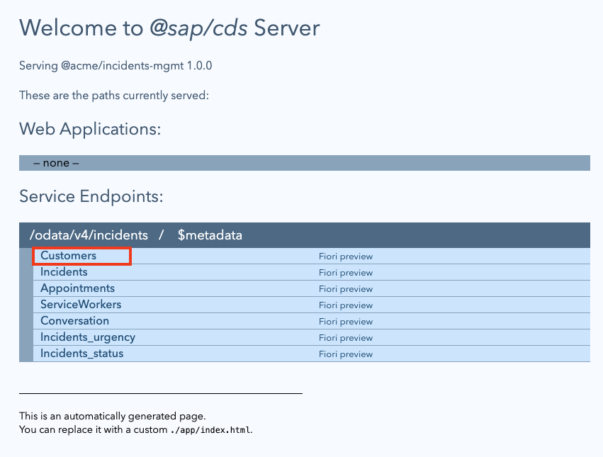
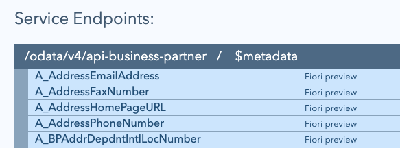

# Exercise 04 - Understand service mocking

At the end of this exercise you'll understand the difference between `cds watch` and `cds run`, and have learned how, during development, the CAP SDK can provide service mocking for rapid & comfortable development cycles.

At this point you've imported the EDMX definition for the external `API_BUSINESS_PARTNER` service, and have a new directory `srv/external/` containing the original EDMX file and a CSN equivalent. Other than that, your basic service definition (at the persistence and service layers) is still the same.

## Start the CAP server

👉 Start things up with `cds run`:

```bash
cds run
```

This should produce log output that looks like this:

```text
[cds] - loaded model from 5 file(s):

  db/schema.cds
  srv/incidents-service.cds
  app/fiori.cds
  srv/external/API_BUSINESS_PARTNER.csn
  ../../../usr/local/share/npm-global/lib/node_modules/@sap/cds-dk/node_modules/@sap/cds/common.cds

[cds] - connect to db > sqlite { url: ':memory:' }
 > init from db/data/acme.incmgt-Appointments.csv
 > init from db/data/acme.incmgt-Incidents.conversation.csv
 > init from db/data/acme.incmgt-Incidents.csv
 > init from db/data/acme.incmgt-Incidents_status.csv
 > init from db/data/acme.incmgt-Incidents_urgency.csv
 > init from db/data/acme.incmgt-Incidents_urgency.texts.csv
 > init from db/data/acme.incmgt-ServiceWorkers.csv
 > init from db/data/acme.incmgt-TeamCalendar.csv
/> successfully deployed to sqlite in-memory db

[cds] - serving IncidentsService { path: '/incidents', impl: 'srv/incidents-service.js' }

[cds] - server listening on { url: 'http://localhost:4004' }
[cds] - launched at 1/30/2023, 12:39:05 PM, version: 6.4.1, in: 1.262s
[cds] - [ terminate with ^C ]
```

👉 Head over to <http://localhost:4004> and see what you get. It's no different than what you saw [at the end of exercise 02](../02-explore-basic-service/README.md#run-the-service):


This sort of makes sense, as `API_BUSINESS_PARTNER` is defined as an external service, one that this service will consume, rather than make available. The only clue that this external service is even acknowledged is in the list of files that are loaded, at the start of the log output:

```text
[cds] - loaded model from 5 file(s):

  db/schema.cds
  srv/incidents-service.cds
  app/fiori.cds
  srv/external/API_BUSINESS_PARTNER.csn   👈
  ../../../usr/local/share/npm-global/lib/node_modules/@sap/cds-dk/node_modules/@sap/cds/common.cds
```

👉 For now, stop the server with Ctrl-C.

## Take a naïve approach to incorporating the external service

Let's take a moment to experiment. Just for a moment, let's take a naïve approach to bringing in this external service into our own basic service, without thinking too much about it. How might that look?

👉 Extend the `srv/incidents-service.cds` file as follows:

* add a `using` statement as recommended in the log output [in the previous exercise when you imported the API specification](../03-import-odata-api/README.md#import-the-api-specification)
* add a new entity `Customers` to the `IncidentsService` service definition, as a projection on the `A_BusinessPartner` entity set in the external service

It should end up looking like this (concentrate here as you'll be undoing this addition shortly):

```cds
using { acme.incmgt } from '../db/schema';
using { API_BUSINESS_PARTNER as external } from './external/API_BUSINESS_PARTNER';

service IncidentsService {
    entity Customers      as projection on external.A_BusinessPartner;
    entity Incidents      as projection on incmgt.Incidents;
    entity Appointments   as projection on incmgt.Appointments;
    entity ServiceWorkers as projection on incmgt.ServiceWorkers;
}
```

While you do this (and assuming you're typing it in manually, like a good participant!) notice how the CDS language support makes it very easy to explore the resources with keyboard completion, as it knows how to read and present the definitions in the recently imported external service:


👉 At the command line, restart the server by stopping the running one with Ctrl-C and then invoking `cds run` again:

```bash
cds run
```

This should produce log output similar to what you saw just before - no discernible difference.

👉 Now head on over to <http://localhost:4004> and note that the Customers entity that you added is now showing up in the list of service endpoints, great!



👉 Select that `Customers` endpoint link <http://localhost:4004/incidents/Customers> (not the Fiori preview one). What do you get?

```xml
<error xmlns="http://docs.oasis-open.org/odata/ns/metadata">
<code>501</code>
<message>Entity "IncidentsService.Customers" is annotated with "@cds.persistence.skip" and cannot be served generically.</message>
</error>
```

Hmm.

Indeed, checking in `srv/external/API_BUSINESS_PARTNER.csn` shows us that this is the truth (you can verify this yourself in the file):

```json
"API_BUSINESS_PARTNER.A_BusinessPartner": {
  "kind": "entity",
  "@cds.external": true,
  "@cds.persistence.skip": true,
  "@sap.deletable": "false",
  "@sap.content.version": "1",
  "@sap.label": "Business Partner",
  "elements": { ... }
}
```

This is because external service definitions, like CSN files that are generated during the import of an API definition (such as we have here), can be used as any other CDS definition, but they don't generate database tables and views unless they are mocked. This is reflected in the use of the `@cds.persistence.skip` annotation, which tells the compiler that the entity shall not exist in the database at all (see the reference to CDS persistence annotations in the [Further reading](#further-reading) section at the end of this exercise).

This makes sense, as we're dealing here with an external, independent service.

Ultimately, we experienced this issue because we (deliberately) used `cds run`.

## Introduce mocking

We used `cds run` to illustrate the issue, or rather the distinction between local and remote services, and the serving thereof. What happens when you use `cds watch` instead of `cds run` here?

👉 Without changing anything in `srv/incidents-service.cds`, terminate the `cds run` command (with Ctrl-C) and execute `cds watch`:

```bash
cds watch
```

Examine the log output, which should now look something like this:

```text
 
cds serve all --with-mocks --in-memory? 
watching: cds,csn,csv,ts,mjs,cjs,js,json,properties,edmx,xml,env,css,gif,html,jpg,png,svg... 
live reload enabled for browsers 

        ___________________________

 
[cds] - loaded model from 5 file(s):

  db/schema.cds
  srv/incidents-service.cds
  app/fiori.cds
  srv/external/API_BUSINESS_PARTNER.csn
  ../../../usr/local/share/npm-global/lib/node_modules/@sap/cds-dk/node_modules/@sap/cds/common.cds

[cds] - connect using bindings from: { registry: '~/.cds-services.json' }
[cds] - connect to db > sqlite { url: ':memory:' }
 > init from db/data/acme.incmgt-Appointments.csv
 > init from db/data/acme.incmgt-Incidents.conversation.csv
 > init from db/data/acme.incmgt-Incidents.csv
 > init from db/data/acme.incmgt-Incidents_status.csv
 > init from db/data/acme.incmgt-Incidents_urgency.csv
 > init from db/data/acme.incmgt-Incidents_urgency.texts.csv
 > init from db/data/acme.incmgt-ServiceWorkers.csv
 > init from db/data/acme.incmgt-TeamCalendar.csv
/> successfully deployed to sqlite in-memory db

[cds] - serving IncidentsService { path: '/incidents', impl: 'srv/incidents-service.js' }
[cds] - mocking API_BUSINESS_PARTNER { path: '/api-business-partner' }

[cds] - server listening on { url: 'http://localhost:4004' }
[cds] - launched at 1/30/2023, 8:05:11 AM, version: 6.4.1, in: 1.215s
[cds] - [ terminate with ^C ]
```

It looks very similar to the output we've just seen from `cds run`, but there are a few essential additions.

## Understand what is happening with mocking

First, we see this:

```text
cds serve all --with-mocks --in-memory? 
watching: cds,csn,csv,ts,mjs,cjs,js,json,properties,edmx,xml,env,css,gif,html,jpg,png,svg... 
live reload enabled for browsers 
```

Most of us may already know about the mind-blowingly useful monitor-and-live-reload feature of `cds watch`, but might not have paid much attention until now to what `cds watch` is really executing for us (in addition to running the file monitor), which is this:

```bash
cds serve all --with-mocks --in-memory? 
```

> On a related note, `cds run` is short for `cds serve all`, but without the `--with-mocks` and `--in-memory?` options. Think of `cds watch` as something that's only relevant for development, not production.

Here's the help text for this option, i.e. the `--with-mocks` option for `cds serve`:

```text
Use this in combination with the variants serving multiple services.
It starts in-process mock services for all required services configured
in package.json#cds.requires, which don't have external bindings
in the current process environment.
Note that by default, this feature is disabled in production and must be
enabled with configuration 'features.mocked_bindings=true'.
```

It's that second sentence that is key for us here. Our imported `API_BUSINESS_PARTNER` service is a required service, in `package.json#cds.requires`. We saw that in the previous exercise when we [imported the API specification](../03-import-odata-api/README.md#import-the-api-specification). It's a required service - but we don't have an external binding for it. So via `--with-mocks`, it will be mocked for us.

This is reflected in another difference in the log output of our invocation of `cds watch`, where we see this additional line:

```text
[cds] - mocking API_BUSINESS_PARTNER { path: '/api-business-partner' }
```

This shows us that the external service is being mocked, and being made available under a separate path in the service. That path is `/api-business-partner`.

👉 Head on over to <http://localhost:4004> to see what is being served in the context of `cds watch` now. You should see something like this (just the first part is shown in this screenshot, there are more entities in the list):



This is a separate second service endpoint that's now being served, at `/api-business-partner`, in addition to the `/incidents` service endpoint, which is listed further down.

👉 Try this mocking out for yourself, by selecting the `A_BusinessPartner` entity from the `api-business-partner` service endpoint, i.e. <http://localhost:4004/api-business-partner/A_BusinessPartner>.

You should be presented with something like this:

```text
{
  @odata.context: "$metadata#A_BusinessPartner",
  value: [ ],
}
```

It's not much, but it's better than an error, it's an actual valid response (check out the [Questions](#questions) section below for a couple of things to ponder on this output).

👉 While you're there, head to the `/incidents` service endpoint and select the `Customers` link. The output should be similar, i.e. no error relating to persistence being skipped:

```text
{
  @odata.context: "$metadata#Customers",
  value: [ ],
}
```

> This (empty) data set, at <http://localhost:4004/incidents/Customers>, is actually the same source as <http://localhost:4004/api-business-partner/A_BusinessPartner>, except of course that the `@odata.context` tells us that semantically (from the data model perspective) the entity is different.

## Learn about the CDS services registry

There was another line in the output from `cds watch` that we don't see in the `cds run` equivalent. Did you spot it?

👉 Head back to the output, and identify the line that looks like this:

```text
[cds] - connect using bindings from: { registry: '~/.cds-services.json' }
```

> Note from the filename that this is in your home directory (`~`) and is a hidden file (the name begins with a period). This is only for non-productive use, in the context of `cds watch`.

This file contains service sections for services provided, and services required, and is written to or fetched from when `cds watch` is invoked (for more information, see the link to the Automatic Binding documentation in the [Further reading](#further-reading) below).

👉 Examine the contents of this file; at this point, you should see something like this:

```json
{
  "cds": {
    "provides": { 
      "API_BUSINESS_PARTNER": {
        "kind": "odata",
        "credentials": {
          "url": "http://localhost:4004/api-business-partner"
        }
      },
      "IncidentsService": {
        "kind": "odata",
        "credentials": {
          "url": "http://localhost:4004/incidents"
        }
      }
    }
  }
}
```

In other words, the CAP server currently started is providing both the locally defined `IncidentsService` but is also providing, via mocking, the `API_BUSINESS_PARTNER` service too.

## Remove the temporary CDS definitions

Right now the service definition (in `srv/external-service.cds`) looks like this:

```cds
using { acme.incmgt } from '../db/schema';
using { API_BUSINESS_PARTNER as external } from './external/API_BUSINESS_PARTNER';

service IncidentsService {
    entity Customers      as projection on external.A_BusinessPartner;
    entity Incidents      as projection on incmgt.Incidents;
    entity Appointments   as projection on incmgt.Appointments;
    entity ServiceWorkers as projection on incmgt.ServiceWorkers;
}
```

Before we finish this exercise, let's clean up, and remove those two lines we added earlier.

👉 Remove the second `using` line, and the line defining a `Customers` entity as a projection on `external.A_BusinessPartner` so that the file contents revert to what they were before, like this:

```cds
using { acme.incmgt } from '../db/schema';

service IncidentsService {
    entity Incidents      as projection on incmgt.Incidents;
    entity Appointments   as projection on incmgt.Appointments;
    entity ServiceWorkers as projection on incmgt.ServiceWorkers;
}
```

👉 Assuming your `cds watch` process is still running at this point, note what happens when these changes are saved and the CAP server restarts. Both service endpoints, i.e. `/api-business-partner` and `/incidents` are still available and being served, and the `/api-business-partner/A_BusinessPartner` resource still returns (an empty) entity set. You can see that this is due to the mocking, not to any of the modifications you'd made to this service layer CDS file. However, you should also notice that the `Customers` resource in the `/incidents` service endpoint is now gone again.

👉 Take a moment to think about the approach we took here to bring in an external service. While it's possible, it's rather too direct, and definitely not the cleanest and most modular approach. This is why we've removed this experiment now.

## Summary

At this point you have the service definition for the Business Partner (A2X) API from SAP S/4HANA Cloud, and have imported it into your CAP project, and now understand how you can have that external service mocked for you, in the same CAP server process as your local service.

## Further reading

* [CDS persistence annotations](https://cap.cloud.sap/docs/cds/annotations#persistence)
* [Automatic Bindings by cds watch](https://cap.cloud.sap/docs/guides/extensibility/composition#bindings-via-cds-watch)
* [Model Projections](https://cap.cloud.sap/docs/guides/using-services#model-projections)

---

## Questions

If you finish earlier than your fellow participants, you might like to ponder these questions. There isn't always a single correct answer and there are no prizes - they're just to give you something else to think about.

1. In the [Understand what is happening with mocking](#understand-what-is-happening-with-mocking) section, you got the following output; what is this, and what does it tell us?

    ```text
    {
      @odata.context: "$metadata#A_BusinessPartner",
      value: [ ],
    }
    ```

---

[Next exercise](../05-add-test-data/)
