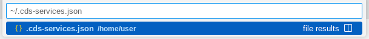

# Exercise 06 - Mock external service in a separate process

At the end of this exercise, you'll have tried out the alternative to in-process mocking, by mocking the service in a separate process.

## Consider the current mocking setup

In [exercise 04](../04-understand-service-mocking/) we ended up with our local `/odata/v4/incidents` service, plus a mocked instance of our external service at `/odata/v4/api-business-partner`, both being served from within the same process, i.e. from the same single CAP server, initiated with `cds watch`.

The salient line in the log output in relation to the mocked external service is this:

```text
[cds] - mocking API_BUSINESS_PARTNER { path: '/odata/v4/api-business-partner' }
```

Requests to resources starting with the path `/odata/v4/api-business-partner` are resolved by the same CAP server that is also resolving requests to the `/odata/v4/incidents` service.

The advantage of having external services mocked like this is clear - it's the simplest and fastest way to get going when developing CAP services that consume other remote services.

But the disadvantage is that this is not representative of how any real cross-service communication will happen. The mocked service doesn't behave as a real external service, and the communication happens in-process, rather than over HTTP using the OData protocol, for example.

## Run the mocked API_BUSINESS_PARTNER service in a separate process

It's possible to mock external services in a completely separate process, and in this section you're going to try that out.

👉 First, stop any CAP server, using Ctrl-C to exit any `cds run` or `cds watch` invocations that might still be active.

👉 After you're sure there's nothing running, start a monitor to display whatever is in the `~/.cds-services.json` file we learned about in [exercise 04](../04-understand-service-mocking/):

```bash
watch -c jq -C . ~/.cds-services.json
```

> The `-c` option to `watch` tells it to interpret ANSI color and style sequences, which we explicitly tell `jq` to emit with the `-C` option. Normally, `jq` won't bother to emit them if it thinks, correctly here, that its output is not directly in the context of a terminal (it's in the context of the `watch` process), but we can force its hand.

> Alternatively, you can just open the `~/.cds-services.json` file in the editor by using the File Selector as [mentioned in a previous exercise](../04-understand-service-mocking/README.md#learn-about-the-cds-services-registry):
>
> 
>
> If you take this approach, you'll only need two terminals in the following sections, not three.

The contents of `~/.cds-services.json` should show that there are currently no services provided, something like this:

```json
{
  "cds": {
    "provides": {},
    "servers": {}
  }
}
```

👉 Now, open up a second terminal (a "split" terminal is recommended, so you can see content in both at the same time), and in there, making sure you're in the `incidents/` directory, start the mocking of the external service like this:

```bash
cds mock API_BUSINESS_PARTNER
```

> What's happening here? Well, as we're beginning to learn, commands that look simple are just syntactic sugar for more explicit and specific invocations. This is shorthand for `cds serve --mocked API_BUSINESS_PARTNER`.

Two things happen that are of interest to us here.

First, we see some log output that looks vaguely familiar:

```text

[cds] - mocking API_BUSINESS_PARTNER { path: '/odata/v4/api-business-partner' }

[cds] - server listening on { url: 'http://localhost:45149' }
```

Note however that it's not the default port 4004 that's being used, it's a random one (45149). Think of this difference as the distinction between the local "main" service at the `/odata/v4/incidents` endpoint that we would want to have served on 4004, and this temporary external service that is just running on a random port as it's "secondary", and would have a different hostname and port (representing the SAP S/4HANA Cloud system) when we move into production anyway.

You can use the `--port` option to specify a port explicitly, if you want, for example `cds mock API_BUSINESS_PARTNER --port 5005`. In fact, we're going to use that now, mostly to make this CodeJam content (and specifically the URLs) consistent and usable for everyone.

👉 Stop that mocked service with Ctrl-C, and then restart it, specifying the explicit port of 5005:

```bash
cds mock API_BUSINESS_PARTNER --port 5005
```

The second thing to notice is that the mocked service appears in the `~/.cds-services.json` file in the `provides` section, with the appropriate URL in the `credentials` section, like this (now with the newly specified port of 5005):

```json
{
  "cds": {
    "provides": {
      "API_BUSINESS_PARTNER": {
        "kind": "odata",
        "credentials": {
          "url": "http://localhost:5005/odata/v4/api-business-partner"
        },
        "server": 9660
      }
    },
    "servers": {
      "9660": {
        "root": "file:///home/user/projects/cap-service-integration-codejam/incidents",
        "url": "http://localhost:5005"
      }
    }
  }
}
```

## Start up the main service

Now we have a mocked version of the external service running in an independent process, we can start up the main service.

👉 Do that now. Open up a third (yes, third) terminal, and, ensuring you're in the `incidents/` directory here too, use `cds watch`:

```bash
cds watch
```

The output should look familiar:

```text

cds serve all --with-mocks --in-memory?
live reload enabled for browsers

        ___________________________

[cds] - loaded model from 5 file(s):

  srv/external/API_BUSINESS_PARTNER.csn
  app/fiori.cds
  srv/incidents-service.cds
  db/schema.cds
  node_modules/@sap/cds/common.cds

[cds] - connect using bindings from: { registry: '~/.cds-services.json' }
[cds] - connect to db > sqlite { url: ':memory:' }
  > init from db/data/acme.incmgt-TeamCalendar.csv
  > init from db/data/acme.incmgt-ServiceWorkers.csv
  > init from db/data/acme.incmgt-Incidents_urgency.texts.csv
  > init from db/data/acme.incmgt-Incidents_urgency.csv
  > init from db/data/acme.incmgt-Incidents_status.texts.csv
  > init from db/data/acme.incmgt-Incidents_status.csv
  > init from db/data/acme.incmgt-Incidents.csv
  > init from db/data/acme.incmgt-Incidents.conversation.csv
  > init from db/data/acme.incmgt-Appointments.csv
/> successfully deployed to in-memory database.

[cds] - using auth strategy { kind: 'mocked', impl: 'node_modules/@sap/cds/lib/auth/basic-auth' }

[cds] - serving IncidentsService { path: '/odata/v4/incidents', impl: 'srv/incidents-service.js' }

[cds] - server listening on { url: 'http://localhost:4004' }
[cds] - launched at 1/29/2024, 12:57:58 PM, version: 7.5.3, in: 1.383s
[cds] - [ terminate with ^C ]

```

Note however that in contrast to when we originally [introduced mocking in exercise 04](../04-understand-service-mocking/README.md#introduce-mocking), the output of this `cds watch` invocation does not include this line:

```text
[cds] - mocking API_BUSINESS_PARTNER { path: '/odata/v4/api-business-partner' }
```

That's because `cds watch` looks in the `~/.cds-services.json` file for running services listed as being provided, and connects to them. In this particular instance, it found the entry for `API_BUSINESS_PARTNER` in there, meaning that there was no need to mock it itself.

👉 Check again the contents of the `~/.cds-services.json` file, where you should now see an entry for the main `IncidentsService` too, on the default port of 4004:

```json
{
  "cds": {
    "provides": {
      "API_BUSINESS_PARTNER": {
        "kind": "odata",
        "credentials": {
          "url": "http://localhost:5005/odata/v4/api-business-partner"
        },
        "server": 9660
      },
      "IncidentsService": {
        "kind": "odata",
        "credentials": {
          "url": "http://localhost:4004/odata/v4/incidents"
        },
        "server": 10198
      }
    },
    "servers": {
      "9660": {
        "root": "file:///home/user/projects/cap-service-integration-codejam/incidents",
        "url": "http://localhost:5005"
      },
      "10198": {
        "root": "file:///home/user/projects/cap-service-integration-codejam/incidents",
        "url": "http://localhost:4004"
      }
    }
  }
}
```

## Stop both services

For simplicity's sake, let's switch back to an in-process mocking setup for now.

👉 Stop the `cds watch` process and the `cds mock` process, and also the `watch` process if it's still running, with Ctrl-C. You can now close all but one terminal window in your workspace.

👉 Now, in the remaining terminal window, run `cds watch` again, which should start a single process, with the CAP server listening on port 4004, mocking the external service and serving your main service too.

## Summary

At this point you have seen your main service up and running at one host/port combination, and the external `API_BUSINESS_PARTNER` service mocked and available at another host/port combination. If you had visited the `A_BusinessPartner` entity set in that mocked service, you would have seen that the data you provided via CSV was still being served (and you would have seen the details of those requests in the log output in the terminal window where you started `cds mock API_BUSINESS_PARTNER`).

## Further reading

* [Mock Remote Service as OData Service (Node.js)](https://cap.cloud.sap/docs/guides/using-services#mock-remote-service-as-odata-service-nodejs)
* [watch (command)](https://en.wikipedia.org/wiki/Watch_(command))
* [Invoking jq](https://jqlang.github.io/jq/manual/#invoking-jq)

---

## Questions

If you finish earlier than your fellow participants, you might like to ponder these questions. There isn't always a single correct answer and there are no prizes - they're just to give you something else to think about.

1. Could you choose any port with the `--port` option? What about, say, port 42, or 1023? What happens, and why? 

---

[Next exercise](../07-add-cds-definitions/)
