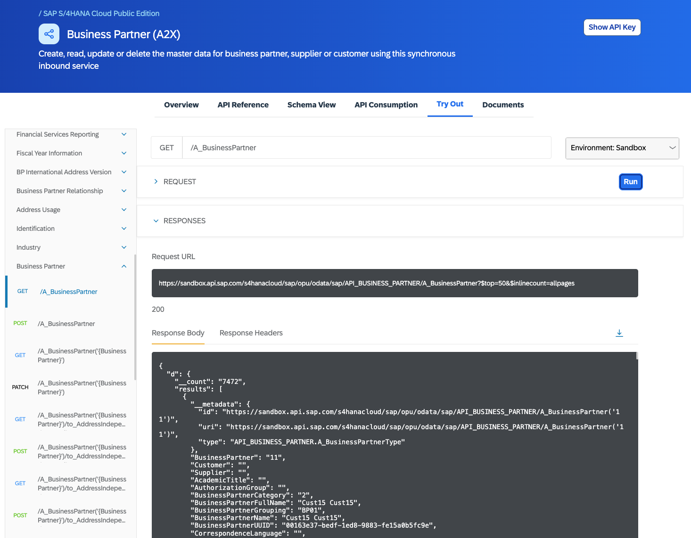

# Exercise 09 - Set up the real remote system configuration

It's time to stop having the CAP server mock things for us, even in a separate process, and start to wire things up for a real connection!

At the end of this exercise you'll have everything configured for a remote connection to a real external service, in a sandbox context. Along the way you'll learn about configuration and configuration profiles. 

At the end of this exercise you'll have your main service integrated with a real remote system for the `API_BUSINESS_PARTNER` based customer data you've integrated via [the definitions in the previous exercise](../07-add-cds-definitions/README.md#consider-the-units-of-definition-and-their-relationships). 

## Terminate the previous mock and watch processes

👉 We're done with trying out mocking in separate processes now, so terminate both the separate process mocking and the main process serving, using Ctrl-C on both. You can also close all but one of the terminal windows.

## Identify and test the remote system

The remote system we'll use is the SAP S/4HANA Cloud sandbox system that we looked briefly at in exercise 03, where we [found and examined the Business Partner API in the SAP API Business Hub](../03-import-odata-api/README.md#find-and-examine-the-business-partner-api).

### Find the remote system

👉 Check out the Configuration Details section of the [Business Partner (A2X)](https://api.sap.com/api/API_BUSINESS_PARTNER/overview) overview in the SAP API Business Hub, where you'll see that the SANDBOX URL is given as:

```text
https://sandbox.api.sap.com/s4hanacloud/sap/opu/odata/sap/API_BUSINESS_PARTNER
```

### Try it out via the SAP API Business Hub

👉 Use the [Try Out](https://api.sap.com/api/API_BUSINESS_PARTNER/tryout) facility and run a request in the default environment, which is the Sandbox. Choose the `GET /A_BusinessPartner` method and endpoint combination (within the "Business Partner" group) and run the request. You should see a response that looks something like this:



### Try it out via a command line HTTP client

In the response information you've just been shown, the request URL for the call that you made is also shown.

👉 Take a quick look at that now, it will be something like this (shown here with whitespace added for readability):

```text
https://sandbox.api.sap.com
  /s4hanacloud/sap/opu/odata/sap/API_BUSINESS_PARTNER/A_BusinessPartner
  ?$top=50
  &$inlinecount=allpages
```

You can see that a GET request with this URL is an OData query operation, in other words we're expecting an entity set response (and indeed you can see the start of that response, in JSON format, in the response body part of the screenshot above). 

The sandbox system that is serving URLs like this is publicly available. 

👉 Take this URL and try it out at the command line in your terminal window now, using `curl`:

```bash
curl \
  --verbose \
  --url 'https://sandbox.api.sap.com/s4hanacloud/sap/opu/odata/sap/API_BUSINESS_PARTNER/A_BusinessPartner?$top=50&$inlinecount=allpages'
```

You get a response, but perhaps not one that you're looking for:

```text
< HTTP/1.1 401 Unauthorized
< Date: Wed, 01 Feb 2023 06:54:07 GMT
< Content-Type: application/json
< Content-Length: 146
< Connection: keep-alive
< 
* Connection #0 to host sandbox.api.sap.com left intact
{"fault":{"faultstring":"Failed to resolve API Key variable request.header.apikey","detail":{"errorcode":"steps.oauth.v2.FailedToResolveAPIKey"}}}
```

👉 Pay attention to the response code and to the JSON in the response payload.

Credentials are required, not via a standard `Authorization` header in the HTTP request, but in the form of a custom header conveying an API key.

### Retrieve your API key

When logged in to the SAP API Business Hub, you can retrieve your API key, either via the link at any given resource (see the "Show API Key" button at the top right in the screenshot above) or by going to your [SAP API Business Hub settings page](https://api.sap.com/settings) (via a menu available in the far top right).

👉 Retrieve your API key; be aware that this is specific to you and should not be shared with anyone. 

### Retry the request, using the API key

Now you have your API key, you can retry the request.

👉 Make another `curl` invocation, this time using the `--header` option to supply the custom header; we'll use `read` to help you input your API key in a comfortable way, rather than have to edit the actual value in the `curl` invocation itself:

```bash
read -rp "API key? " APIKEY \
&& curl \
  --verbose \
  --compressed \
  --location \
  --header "APIKey: $APIKEY" \
  --url 'https://sandbox.api.sap.com/s4hanacloud/sap/opu/odata/sap/API_BUSINESS_PARTNER/A_BusinessPartner?$top=50&$inlinecount=allpages' 
```

> The `--compressed` option tells `curl` to request (and, more importantly, expect) compressed response payloads and the `--location` option tells `curl` to follow any redirect responses automatically.

Perhaps unexpectedly, you get a wall of XML in response, that starts out like this (heavily reduced for brevity):

```text
<feed xmlns="http://www.w3.org/2005/Atom" xmlns:m="http://schemas.microsoft.com/ado/2007/08/dataserv
ices/metadata" xmlns:d="http://schemas.microsoft.com/ado/2007/08/dataservices" xml:base="https://san
dbox.api.sap.com/s4hanacloud/sap/opu/odata/sap/API_BUSINESS_PARTNER/"><id>https://sandbox.api.sap.co
m/s4hanacloud/sap/opu/odata/sap/API_BUSINESS_PARTNER/A_BusinessPartner</id><title type="text">A_Busi
nessPartner</title><updated>2023-02-06T13:19:04Z</updated><author><name/></author><link href="A_Busi
nessPartner" rel="self" title="A_BusinessPartner"/><m:count>6494</m:count><entry><id>https://sandbox
.api.sap.com/s4hanacloud/sap/opu/odata/sap/API_BUSINESS_PARTNER/A_BusinessPartner('11')</id><title t
ype="text">A_BusinessPartner('11')</title><updated>2023-02-06T13:19:04Z</updated><category term="API
_BUSINESS_PARTNER.A_BusinessPartnerType" scheme="http://schemas.microsoft.com/ado/2007/08/dataservic
es/scheme"/><link href="A_BusinessPartner('11')" rel="edit" title="A_BusinessPartnerType"/><link hre
f="A_BusinessPartner('11')/to_BuPaIdentification" rel="http://schemas.microsoft.com/ado/2007/08/data
services/related/to_BuPaIdentification" type="application/atom+xml;type=feed" title="to_BuPaIdentifi
cation"/><link href="A_BusinessPartner('11')/to_BuPaIndustry" rel="http://schemas.microsoft.com/ado/
2007/08/dataservices/related/to_BuPaIndustry" type="application/atom+xml;type=feed" title="to_BuPaIn
dustry"/><link href="A_BusinessPartner('11')/to_BusinessPartnerAddress" rel="http://schemas.microsof
t.com/ado/2007/08/dataservices/related/to_BusinessPartnerAddress" type="application/atom+xml;type=fe
ed" title="to_BusinessPartnerAddress"/><link href="A_BusinessPartner('11')/to_BusinessPartnerBank" r
el="http://schemas.microsoft.com/ado/2007/08/dataservices/related/to_BusinessPartnerBank" type="appl
ication/atom+xml;type=feed" title="to_BusinessPartnerBank"/><link href="A_BusinessPartner('11')/to_B
usinessPartnerContact" rel="http://schemas.microsoft.com/ado/2007/08/dataservices/related/to_Busines
```

> For those interested, this width-wrapped version of the output (produced because otherwise the single long line of output wouldn't display very well in this document) was produced by feeding the output of the above `curl` invocation into `| fold -w100 | head -20`. 

This of course is the standard OData V2 XML based payload format, and incidentally we can see OData's origins right there in front of us (starting with the `feed` element) - the [Atom Syndication Format](https://www.rfc-editor.org/rfc/rfc4287). You can read more on the origins of OData - see the links in the [Further reading](#further-reading) section below.

## Store configuration for the remote system

Now that we've identified the sandbox system as the remote system we're going to use, tried it out, and also have the requisite API key with which to authenticate requests, we can store that information in a way that can be used by the CAP server. 

This is information typically held via, and managed by, the Destination service on SAP Business Technology Platform. The SAP Cloud SDK that we introduced into the mix in the previous exercise can work with destination objects defined there, or in other abstract places, such as in CAP's environment configuration.

Given that this is not a productive setup, we can use CAP's configuration profile feature (see the link in the [Further reading](#further-reading) section below). 

### Consider storing configuration in package.json

So one place we could store the URL and API key is in our `package.json` file. 

👉 Open your incidents project's `package.json` file and examine the `cds.requires` section. It should look something like this:

```json
"cds": {
  "requires": {
    "db": {
      "kind": "sql"
    },
    "API_BUSINESS_PARTNER": {
      "kind": "odata-v2",
      "model": "srv/external/API_BUSINESS_PARTNER"
    }
  }
}
```

Remember that the `API_BUSINESS_PARTNER` stanza we can see here was added automatically when we [imported the API specification](../03-import-odata-api/README.md#import-the-api-specification) in exercise 03.

What would it look like if we stored the URL and API key in here? Well, we already have a rough idea, from the contents of the `~/.cds-services.json` file that is dynamically and automatically maintained by the local CAP server. We saw an example in [exercise 06](06-mock-separate-process):

```json
"API_BUSINESS_PARTNER": {
  "kind": "odata",
  "credentials": {
    "url": "http://localhost:5005/api-business-partner"
  }
}
```

In other words, they're stored in an object that is the value of a `credentials` property.

If we were to add this information within a "sandbox" profile, it would look like this:

```json
"cds": {
  "requires": {
    "db": {
      "kind": "sql"
    },
    "API_BUSINESS_PARTNER": {
      "[sandbox]": {
        "kind": "odata-v2",
        "model": "srv/external/API_BUSINESS_PARTNER",
        "credentials": {
          "url": "https://sandbox.api.sap.com/s4hanacloud/sap/opu/odata/sap/API_BUSINESS_PARTNER/",
          "headers": {
            "APIKey": "<YOUR-API-KEY>"
          }
        }
      }
    }
  }
}
```

👉 Take a moment to stare at that construct, and understand how the profile name "sandbox", in square brackets, has been "injected" into the JSON structure for the `API_BUSINESS_PARTNER` details. This leaves room for details in the contexts of other profiles.

This is neat, but opens up a big problem with security (adding an API key into a file that is checked in to the source code control system as part of the project contents), and it also makes the configuration a lot more brittle than it could or should be.

### Using the .env file

On the command line, you can specify individual environment variables when starting up the CAP server. This is a standard UNIX feature. CAP extends that feature by looking for similar values in a special `.env` file (see the link to project-specific configurations in the [Further reading](#further-reading) section below). 

On startup, the final configuration is determined from a combination of values from different places, including the `cds` section of the project's `package.json` file, and also values in this `.env` file too.

#### Examine the current configuration

The `cds` command line tool sports an `env` command with which the effective configuration of the current environment can be examined. 

👉 Examine the current environment configuration right now:

```bash
cds env get
```

That produces quite a large amount of output. 

👉 Run the command again, this time narrowing it down to the detail for the required `API_BUSINESS_PARTNER` section:

```bash
cds env get requires.API_BUSINESS_PARTNER
```

This produces what we want to see at this point, which is something like this:

```text
{
  impl: '@sap/cds/libx/_runtime/remote/Service.js',
  external: true,
  kind: 'odata-v2',
  model: 'srv/external/API_BUSINESS_PARTNER'
}
```

👉 Rerun the command but use `ls` instead of `get`, to see the same information but in a different format:

```bash
cds env ls requires.API_BUSINESS_PARTNER
```

You'll see something like this (which is known as "properties format"):

```text
requires.API_BUSINESS_PARTNER.external = true
requires.API_BUSINESS_PARTNER.impl = @sap/cds/libx/_runtime/remote/Service.js
requires.API_BUSINESS_PARTNER.kind = odata-v2
requires.API_BUSINESS_PARTNER.model = srv/external/API_BUSINESS_PARTNER
```

#### Add configuration in .env

👉 Create a `.env` file in the `incidents/` directory (the project root) with the following contents, making sure you substitute your actual API key for `<YOUR-API-KEY>`:

```text
DEBUG=remote
cds.requires.API_BUSINESS_PARTNER.[sandbox].credentials.url=https://sandbox.api.sap.com/s4hanacloud/sap/opu/odata/sap/API_BUSINESS_PARTNER
cds.requires.API_BUSINESS_PARTNER.[sandbox].credentials.headers.APIKey=<YOUR-API-KEY>
```

> The `DEBUG=remote` will cause extra debugging logs to be emitted when remote systems are accessed.

This uses the same properties format as above. Can you see how the dotted notation follows the structure of the JSON hierarchy? 

#### Check the final combined configuration

👉 Now re-run the `cds env` command to look at the final configuration, a combination of values in the `cds` section of `package.json` and the contents of `.env`:

```bash
cds env get requires.API_BUSINESS_PARTNER
```

Oh. 

There's no change:

```text
{
  impl: '@sap/cds/libx/_runtime/remote/Service.js',
  external: true,
  kind: 'odata-v2',
  model: 'srv/external/API_BUSINESS_PARTNER'
}
```

That's because we need to use the global `--profile` option available on all `cds` commands, to specify the effective configuration profile, "sandbox".

👉 Do that now:

```bash
cds env get requires.API_BUSINESS_PARTNER --profile sandbox
```

You should now see something like this:

```text
{
  impl: '@sap/cds/libx/_runtime/remote/Service.js',
  external: true,
  kind: 'odata-v2',
  model: 'srv/external/API_BUSINESS_PARTNER',
  credentials: {
    url: 'https://sandbox.api.sap.com/s4hanacloud/sap/opu/odata/sap/API_BUSINESS_PARTNER/',
    headers: { APIKey: 'your-actual-api-key' }
  }
}
```

Great!

## Summary

At this point you have everything configured for a connection to a real remote system, and configured in such a way that is:

* manageable (in a configuration profile)
* abstract (independent of the service and other configuration)
* secure (no credentials checked into source control)

## Further reading

* [Exploring API specifications on the SAP API Business Hub](https://www.youtube.com/watch?v=tW0-96gGQAs&list=PL6RpkC85SLQABOpzhd7WI-hMpy99PxUo0&index=2) (video)
* [Monday morning thoughts: OData](https://blogs.sap.com/2018/08/20/monday-morning-thoughts-odata/)
* [Tutorial: Learn about OData Fundamentals](https://developers.sap.com/tutorials/odata-01-intro-origins.html)
* [Configuration Profiles](https://cap.cloud.sap/docs/node.js/cds-env#profiles) in CAP
* [Project-Specific Configurations](https://cap.cloud.sap/docs/node.js/cds-env) in CAP

---

## Questions

If you finish earlier than your fellow participants, you might like to ponder these questions. There isn't always a single correct answer and there are no prizes - they're just to give you something else to think about.

1. In the `curl` invocation, the `--compressed` option was used. There was a response header that tells us what the compression technique was - what was that response header and what was the encoding?

1. When [requesting business partner data from the sandbox](#retry-the-request-using-the-api-key) we got an XML response. If we wanted a JSON response (to match what we got when trying it out in the sandbox on the SAP API Business Hub website), how might we request that? There are two ways - what are they?

---

[Next exercise](../10-run-with-real-remote-delegation/)
