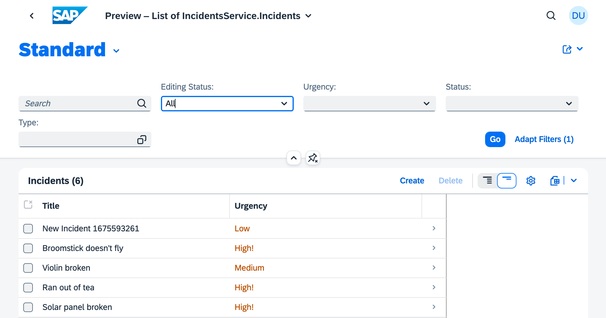

# Exercise 11 - Associate local and remote entities

At the end of this exercise, your main "incidents" service will be related to the external service through an association, and you'll have put that to the test by creating a new incident for a customer.

## Examine what we have so far

All we have so far in terms of any relationship between the main service and the external service is the simple projection onto the `Customers` entity defined in the `index.cds` file (the "front door") in the section of the service layer that represents the external service, i.e. in `srv/external/`. This projection is defined in the `mashup.cds` file which sits delicately between remote entities in the external service, and the entities in the local service.

That might be a little tough to visualize, so let's spend some time looking at how all the parts come together, and how the flexibility and beauty of certain CDS language elements allow us to maintain clean, abstract and layered solutions, with components that we define directly, but also with components that we can import, transform and make use of.

👉 Take a couple of moments to stare at this extended version of the diagram that we looked at in exercise 07 where we [considered the units of definition and their relationships](../07-add-cds-definitions/README.md#consider-the-units-of-definition-and-their-relationships). The projection mentioned above is marked with the arrow with the legend "PROJECTION":

```text
         +--      +-[ API_BUSINESS_PARTNER.csn : API_BUSINESS_PARTNER ]-------------------------+
         |        |                                                                             |
         |        |  Definitions from remote service:                                           |
         |        |      A_BusinessPartner,                        <--+                         |
         |        |      ...                                          |                         |
         |        |                                                   |                         |
         |        +---------------------------------------------------|-------------------------+
         |                                           |                |
external |                                           |                |
service  |                                           v                |
         |        +-[ index.cds : s4.simple.Customers ]---------------|-------------------------+
         |        |                                                   |                         |
         |        |  entity Customers as projection on API_BUSINESS_PARTNER.A_BusinessPartner { |
         |        |    key BusinessPartner as ID,                                               |
         |        |    BusinessPartnerFullName as name             <--+                         |
         |        |  }                                                |                         |
         |        |                                                   |                         |
         +--      +---------------------------------------------------|-------------------------+
                                                     |                |
                                                     |            PROJECTION
                                                     v                |
         +--      +-[ mashup.cds : <integration> ]--------------------|-------------------------+
         |        |                                                   |                         |
         |     +---- extend service IncidentsService with {           |                         |
         |     |  |    entity Customers as projection on s4.simple.Customers;                   |
         |     |  |  }                                                                          |
         |     |  |                                                                             |
         |     |  +-----------------------------------------------------------------------------+
         |     |                                     |
service  |     |                                     |
 layer   |     |                                     v
         |     |  +-[ incidents-service.cds : IncidentsService ]--------------------------------+
         |     |  |                                                                             |
         |     +---> service IncidentsService {                                                 |
         |        |    entity Incidents as projection on incmgt.Incidents; --------------+      |
         |        |    entity Appointments as projection on incmgt.Appointments;         |      |
         |        |    entity ServiceWorkers as projection on incmgt.ServiceWorkers;     |      |
         |        |  }                                                                   |      |
         |        |                                                                      |      |
         +--      +----------------------------------------------------------------------|------+
                                                     ^                                   |
                                                     |                                   |
                                                     |                                   |
         +--      +-[ schema.cds : Incidents, Appointments, etc ]------------------------|------+
         |        |                                                                      |      |
         |        |  namespace acme.incmgt;                                              |      |
         |        |                                                                      |      |
         |        |  entity Incidents : cuid, managed {                               <--+      |
         |        |    title: String @title : 'Title';                                          |
  db     |        |    ...                                                                      |
 layer   |        |    service: Association to Appointments;                                    |
         |        |  }                                                                          |
         |        |                                                                             |
         |        |  entity Appointments {                                                      |
         |        |    ...                                                                      |
         |        |  }                                                                          |
         +--      +-----------------------------------------------------------------------------+
```

## Create an association between the Customers and Incidents entities

Incidents on their own don't make much sense. What we need to make this service more useful is to be able to associate incidents with customers. Let's do that now.

👉 Open the `srv/mashup.cds` file, our bridge between local and remote services.

👉 In the existing first line, add `acme.incmgt` to the list of items that are to be imported from `./incidents-service`, so that it reads as follows:

```cds
using { acme.incmgt, IncidentsService } from './incidents-service';
```

👉 With this newly imported `acme.incmgt` available, now add another `extends` section below the one that's already there, as follows:

```cds
extend incmgt.Incidents with {
  customer : Association to s4.simple.Customers;
}
```

👉 Think about what this `extend` section is doing. Using the diagram above, can you identify what entities, from which levels, are being connected?

### Check the effect of this association on the existing service

What effect does this new association have? Let's check.

👉 Make sure your CAP server has restarted due to the change (your `cds watch --profile sandbox` process is still running, right?) and visit the `Incidents` entity set at <http://localhost:4004/incidents/Incidents>. Check the individual entities in the response. Here's one of them, for example:

```json
{
  "ID": "2b23bb4b-4ac7-4a24-ac02-aa10cabd842c",
  "createdAt": "2023-02-02T14:48:42.252Z",
  "createdBy": "anonymous",
  "modifiedAt": "2023-02-02T14:48:42.252Z",
  "modifiedBy": "anonymous",
  "title": "Broomstick doesn't fly",
  "urgency": "high",
  "status": "closed",
  "service_ID": "1",
  "customer_ID": null,
  "IsActiveEntity": true,
  "HasActiveEntity": false,
  "HasDraftEntity": false
}
```

There's a new property in this (and all other) entity objects returned in the entity set: `customer_ID`.

> Of course, this is a new property, for the association, and the data in the CSV files that are used to seed the service doesn't include any values that represent any such associations, so the value for this property in each existing entity is `null`.


👉 Now head on over to the service metadata at <http://localhost:4004/incidents/$metadata> and find the definition of the `Incidents` entity type as it appears in this EDMX format. It should look something like this:

```xml
<EntityType Name="Incidents">
  <Key>
    <PropertyRef Name="ID"/>
    <PropertyRef Name="IsActiveEntity"/>
  </Key>
  <Property Name="ID" Type="Edm.Guid" Nullable="false"/>
  <Property Name="createdAt" Type="Edm.DateTimeOffset" Precision="7"/>
  <Property Name="createdBy" Type="Edm.String" MaxLength="255"/>
  <Property Name="modifiedAt" Type="Edm.DateTimeOffset" Precision="7"/>
  <Property Name="modifiedBy" Type="Edm.String" MaxLength="255"/>
  <Property Name="title" Type="Edm.String"/>
  <Property Name="urgency" Type="Edm.String"/>
  <Property Name="status" Type="Edm.String"/>
  <NavigationProperty Name="conversation" Type="Collection(IncidentsService.Conversation)" Partner="up_">
    <OnDelete Action="Cascade"/>
  </NavigationProperty>
  <NavigationProperty Name="service" Type="IncidentsService.Appointments">
    <ReferentialConstraint Property="service_ID" ReferencedProperty="ID"/>
  </NavigationProperty>
  <Property Name="service_ID" Type="Edm.String"/>
  <NavigationProperty Name="customer" Type="IncidentsService.Customers">
    <ReferentialConstraint Property="customer_ID" ReferencedProperty="ID"/>
  </NavigationProperty>
  <Property Name="customer_ID" Type="Edm.String" MaxLength="10"/>
  <NavigationProperty Name="urgency_" Type="IncidentsService.Incidents_urgency">
    <ReferentialConstraint Property="urgency" ReferencedProperty="value"/>
  </NavigationProperty>
  <NavigationProperty Name="status_" Type="IncidentsService.Incidents_status">
    <ReferentialConstraint Property="status" ReferencedProperty="value"/>
  </NavigationProperty>
  <Property Name="IsActiveEntity" Type="Edm.Boolean" Nullable="false" DefaultValue="true"/>
  <Property Name="HasActiveEntity" Type="Edm.Boolean" Nullable="false" DefaultValue="false"/>
  <Property Name="HasDraftEntity" Type="Edm.Boolean" Nullable="false" DefaultValue="false"/>
  <NavigationProperty Name="DraftAdministrativeData" Type="IncidentsService.DraftAdministrativeData" ContainsTarget="true"/>
  <NavigationProperty Name="SiblingEntity" Type="IncidentsService.Incidents"/>
</EntityType>
```

👉 Focus in on the relevant part of this entity type definition that has now appeared for this association, which is this combination of `NavigationProperty` and `Property`:

```xml
<NavigationProperty Name="customer" Type="IncidentsService.Customers">
  <ReferentialConstraint Property="customer_ID" ReferencedProperty="ID"/>
</NavigationProperty>
<Property Name="customer_ID" Type="Edm.String" MaxLength="10"/>
```

Adding this new association seems to have achieved what we need - a relationship between customers and incidents. Let's continue.

## Add a new incident for a customer

At this point we now have the `customer` property in the `Incidents` entity as defined at the CDS level. Being a managed association, this has a generated field of `customer_ID` at the OData metadata level, the level at which we interact with the actual service.

Let's do that now, by using the [REST Client](https://marketplace.visualstudio.com/items?itemName=humao.rest-client) extension that should be available in your workspace (it's built in to the Dev Space, and [listed as on of the extensions to install into the dev container](../../.devcontainer/devcontainer.json) if you're using VS Code).

👉 Create a file called `newincident.http` in the `incidents/` project directory with the following contents:

```text
###
# @name CustomersQuery

GET http://localhost:4004/incidents/Customers?$top=5

###
# @name IncidentsCreate

@customer_ID = {{ CustomersQuery.response.body.value[0].ID }}

POST http://localhost:4004/incidents/Incidents
Content-Type: application/json

{
  "title": "New Incident {{$timestamp}}",
  "urgency": "low",
  "customer_ID": "{{customer_ID}}"
}

###
@id = {{IncidentsCreate.response.body.$.ID}}

POST http://localhost:4004/incidents/Incidents(ID={{id}},IsActiveEntity=false)/draftActivate
Content-Type: application/json
```

This file contains three HTTP requests, that are designed to be executed one at a time, in the order that they're presented. When you view the file in your workspace editor, the contents should be recognized and "Send request" links should become available.

👉 Consider what the requests in this file are doing:

1. First there is an OData query operation ("CustomersQuery") to get a list of the customers via the `Customers` entity set which is our projection onto the external service. This is so we have a customer ID to use in the next request.
1. Next comes an OData create operation ("IncidentsCreate") which sends a payload in a POST request to the `Incidents` entity set. The payload is a JSON representation of some of the properties of the entity type: the incident's title and urgency, and the ID of the customer with which the new incident should be associated. There are a couple of variables used here; the `$timestamp` is used to distinguish multiple new incidents, in case you want create more than one, and the `customer_ID` which is a reference to the determination of the ID of the first entity in the entity set returned from the first (query) operation, via `CustomersQuery.response.body.value[0].ID`.
1. Finally there's a third request that turns a draft into an active entry which is required for all changes to entities managed by SAP Fiori's draft mechanism - see the link in the [Further reading](#further-reading) section below for more information.

👉 Now that you understand what these requests are, make them, one after the other, by using the "Send request" links. Take a moment to look at the HTTP responses, too.

## Confirm the customer ID entry

At this point, you have a new incident relating to a customer. To finish off this exercise, let's just make sure we know what's happened.

👉 Perform an OData query operation to find the incident you just created, by visiting this URL: <http://localhost:4004/incidents/Incidents?$filter=startswith(title,%27New%20Incident%27)%20and%20urgency%20eq%20%27low%27>, which, when URL-decoded and made more readable with whitespace, looks like this:

```text
http://localhost:4004/incidents/Incidents
  ?$filter=startswith(title,'New Incident') and urgency eq 'low'
```

It would be nice to see this customer displayed in the Fiori UI too. Right now, the new incident appears in the [list report](http://localhost:4004/$fiori-preview/IncidentsService/Incidents#preview-app), as shown in this screenshot:



But even when you select it and are taken to the corresponding object page for the selected incident, there's no sign of the customer information.

We'll address that in the next exercise.

## Summary

At this point you have more deeply integrated the external service with your own, by cleanly and neatly creating a managed association between the `Incidents` entity in your local service and the `A_BusinessPartner` entity, customized and abstracted as `Customers`, from the remote service.

## Further reading

* [CAP's support for Fiori's Draft-Based Editing](https://cap.cloud.sap/docs/advanced/fiori#draft-support)
* [Managed associations in CAP](https://cap.cloud.sap/docs/guides/domain-models#managed-associations)

---

## Questions

If you finish earlier than your fellow participants, you might like to ponder these questions. There isn't always a single correct answer and there are no prizes - they're just to give you something else to think about.

1. The name of the new property that appeared in each `Incidents` entity was `customer_ID`. Where does that name (especially the `_ID` part) come from? This name appears as the name of the new `Property` element in the `Incidents` entity type definition in the metadata too, and there, there's a value of `10` for the `MaxLength` attribute. Where is that coming from?

---

[Next exercise](../12-extend-fiori-ui-with-annotations/)
