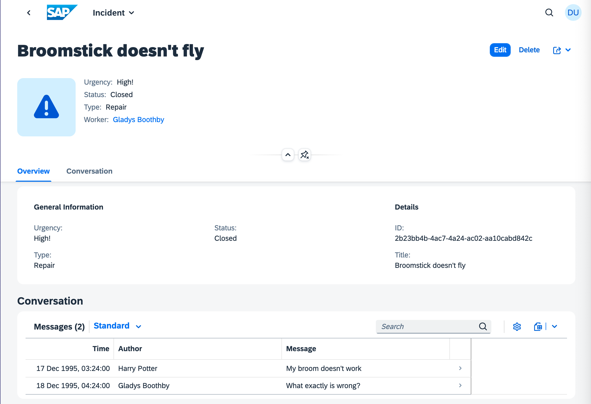
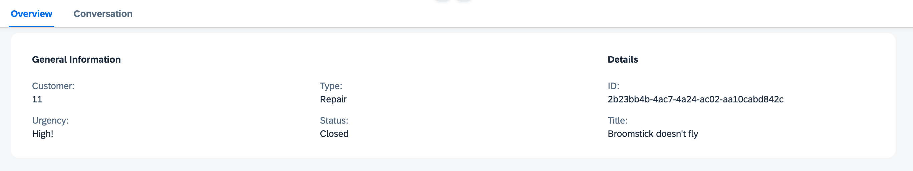
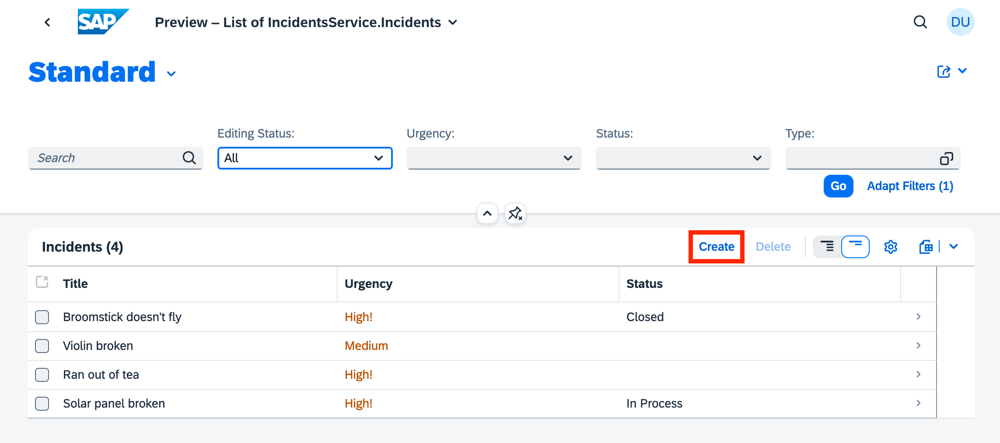
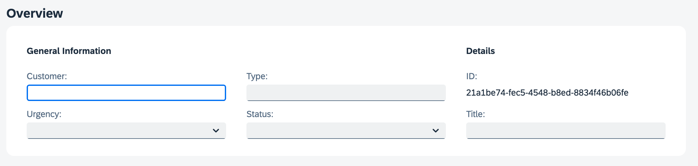
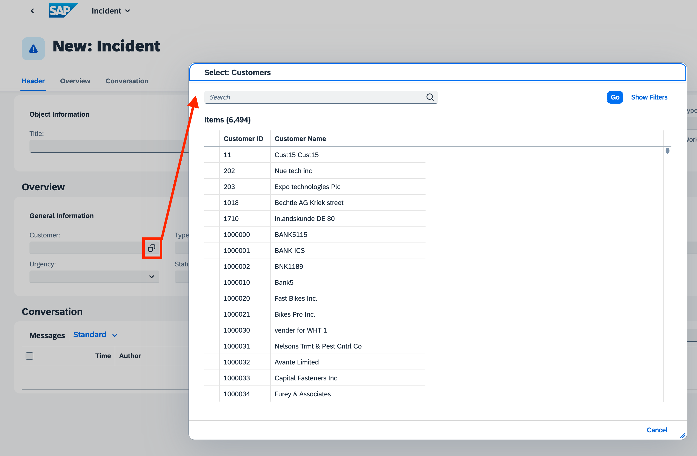

# Exercise 12 - Extend SAP Fiori elements UI with annotations

At the end of this exercise, you'll have taken the first tentative steps into adding some OData annotations for the SAP Fiori elements based previews provided out of the box by CAP.

## Add a customer relation to one of the existing incidents

We're taking advantage of `cds watch` and the automatic reloading of the definitions each time we edit files. But because we're still just in the mocking stage for our local service, data is reset to what's in the CSV files on restart.

So to save time, and prevent you from having to re-execute the HTTP requests in `newincident.http` each time you add an annotation, let's add a customer relation to one of the existing incidents in the corresponding CSV file.

👉 With the CAP server still running (with `cds watch --profile sandbox`), identify the ID of a customer in the same way the first of the three requests in `newincident.http` did, by going to <http://localhost:4004/incidents/Customers?$top=5> and selecting the first one.

> What you're after is this, essentially: <http://localhost:4004/incidents/Customers?$top=1&$select=ID>.

👉 Modify the `db/data/acme.incmgt-Incidents.csv` file to add `customer_ID` as a field to the start of the header line, and to insert a column so that the first record ("Broomstick doesn't fly") has the customer ID value you just obtained (and that the other records have at least an extra semi-colon, as shown here, where `11` is the customer ID):

```csv
customer_ID;ID;title;urgency;status;service_ID
11;2b23bb4b-4ac7-4a24-ac02-aa10cabd842c;Broomstick doesn't fly;high;closed;1
;7a4ede72-244a-4f5f-8efa-b17e032d01ee;Ran out of tea;high;;
;6ccf474c-3881-44b7-99fb-59a2a4668418;Violin broken;medium;;
;9583f982-d7df-4aad-ab26-301d4a157cd7;Solar panel broken;high;in process;2
```

> The easiest thing here would be to copy this entire section and use it to replace whatever is in `db/data/acme.incmgt-Incidents.csv` as aligning columns in CSV files is trickier than you think!

Now each time the CAP server restarts, you have at least one incident that is related to a customer already.

## Examine the incident in the SAP Fiori elements preview

Let's take a look at what the default object page shows us for the first incident.

👉 Open the Fiori preview for the `Incidents` entity, via this URL: <http://localhost:4004/$fiori-preview/IncidentsService/Incidents#preview-app>, and select the "Broomstick doesn't fly" entry to navigate from the list report to the object page for that selected incident. You should see something similar to this:



There's no reference to any customer information here yet.

## Add customer ID to the General Information section of the object page

In this SAP Fiori elements object page you can see a field group titled "General Information" containing the "Urgency", "Status" and "Type" fields.

Let's have the customer ID show up here. This customization relates to our incidents service (and not directly to the remote service), so it makes sense to add the required annotation in the `srv/mashup.cds` file, in the service layer.

👉 In `srv/mashup.cds`, append the following lines:

```cds
using from '../app/fiori';

annotate IncidentsService.Incidents with @(
  UI: {
    FieldGroup #GeneralInformation : {
      Data: [
        { Value: customer_ID, Label: 'Customer'},
        ...
      ]
    },
  }
);
```

> The `...` ellipsis is important here, and not part of the illustration in this exercise - so don't remove it. It's special syntax for referring to the "remaining values" of array-valued annotations. The advantage of this syntax is that you do not have to repeat the other table columns. See the link to Extend Array Annotations in the [Further reading](#further-reading) section below.

## Re-examine the incident to see the customer reference

👉 At this point, after the CAP server restarts, following your changes to `srv/mashup.cds`, re-examine the object page for the "Broomstick doesn't fly" incident (you can re-navigate there or just hit refresh in the browser, if an automatic refresh hasn't taken place).

You should now see the new "Customer" field in the "General Information" field group:



## Start to create a new incident

👉 Return to the list report at <http://localhost:4004/$fiori-preview/IncidentsService/Incidents#preview-app> and use the "Create" action (highlighted here) to start the process of creating a new incident:



Note that the Customer field is open for input, but that's about it; there isn't an easy way to find a customer:



Let's address that now.

## Annotate the Customers entity

Let's extend our adoption of the external service, and add extra customization information in the CDS that we [referred to as the "front door" in the previous exercise](../11-associate-local-remote-entities/README.md#examine-what-we-have-so-far).

👉 In the `srv/external/index.cds` file, append the following:

```cds
annotate Customers with @cds.odata.valuelist;

annotate Customers with {
  ID   @title : 'Customer ID';
  name @title : 'Customer Name';
}
```

Let's start with the second of the two `annotate` expressions here. It's fairly easy to think about: it adds `@title` annotations to each of the properties in the entity defined just above it in the file; the effect of this is that "Customer ID" and "Customer Name" will appear as column headers instead of the raw property names "ID" and "name" (you'll see this shortly in the popup that will appear when we invoke Value Help).

The first is a little bit more special. The `@cds.odata.valuelist` annotation provides advanced, convenient support for Value Help as understood and supported by SAP Fiori. When added to an entity, like here, all managed associations targeting this entity will automatically receive Value Help lists. This single annotation causes the generation of various `@Common.ValueList` annotations.

👉 To see this, once you've added these annotations and seen the CAP server restart, have a look at the metadata document for the `/incidents` service endpoint, i.e. at <http://localhost:4004/incidents/$metadata>, where you'll find this new section for the `IncidentService.Incidents/customer_ID` target:


```xml
<Annotations Target="IncidentsService.Incidents/customer_ID">
  <Annotation Term="Common.ValueList">
    <Record Type="Common.ValueListType">
      <PropertyValue Property="Label" String="Customers"/>
      <PropertyValue Property="CollectionPath" String="Customers"/>
      <PropertyValue Property="Parameters">
        <Collection>
          <Record Type="Common.ValueListParameterInOut">
            <PropertyValue Property="LocalDataProperty" PropertyPath="customer_ID"/>
            <PropertyValue Property="ValueListProperty" String="ID"/>
          </Record>
          <Record Type="Common.ValueListParameterDisplayOnly">
            <PropertyValue Property="ValueListProperty" String="name"/>
          </Record>
        </Collection>
      </PropertyValue>
    </Record>
  </Annotation>
</Annotations>
```

See the [Further reading](#further-reading) section below for more information on Value Help support.

## Observe the effect of your new annotations

👉 Just like you did before, return to the list report at <http://localhost:4004/$fiori-preview/IncidentsService/Incidents#preview-app> and use the "Create" action (highlighted here) to start the process of creating a new incident again.

This time, you'll see that as well as the Customer field being open for input, there's now a symbol in the field indicating that there's Value Help available.

👉 Select that symbol to bring up the Value Help. You should see a Value Help pop up, like this:



👉 Observe also that the column headings in the list of customers are as defined with the other annotations you just added ("Customer ID" and "Customer Name").

👉 Perhaps most importantly, take a look at the CAP server log records that were emitted when you invoked this Value Help. You should see something like this:

```text
[cds] - > READ Customers { '$select': 'ID,name', '$count': 'true', '$orderby': 'ID', '$skip': '0', '$top': '73' }
>> delegating to remote service...
[remote] - GET https://sandbox.api.sap.com/s4hanacloud/sap/opu/odata/sap/API_BUSINESS_PARTNER/A_BusinessPartner?$select=BusinessPartner,BusinessPartnerFullName&$orderby=BusinessPartner%20asc&$inlinecount=allpages&$top=73 {
  headers: {
    accept: 'application/json,text/plain',
    'accept-language': 'en-GB',
    'x-correlation-id': 'e724c7db-14da-47f9-a219-24d4ec12b784'
  },
  data: undefined
}
```

The resolution of the Value Help is being provided via the JavaScript we added in an earlier exercise to `srv/external-service.js`, and in turn using the SAP Cloud SDK to make an OData query operation on the remote, external service.

## Summary

At this point you've just started to scratch the surface of what's possible with annotations, where OData and SAP Fiori meet. Due partly to remaining focused on service-level integration, but mostly due to time constraints, this CodeJam does not cover SAP Fiori annotations any more than what you've seen in this exercise.

And so you're at the end of the CodeJam, congratulations for making it all this way! You've seen how CAP and CDS make have tremendously powerful and useful affordances for integrating remote services and mashing up entities both local and remote. Happy exploring!

## Further reading

* [A deep dive into OData and CDS annotations](https://qmacro.org/blog/posts/2023/03/10/a-deep-dive-into-odata-and-cds-annotations/)
* [Extend Array Annotations](https://cap.cloud.sap/docs/cds/cdl#extend-array-annotations)
* [Supported floorplans in SAP Fiori elements](https://experience.sap.com/fiori-design-web/smart-templates/#supported-floorplans)
* [Value Help Support](https://cap.cloud.sap/docs/advanced/fiori#value-help-support)

---

## Questions

If you finish earlier than your fellow participants, you might like to ponder these questions. There isn't always a single correct answer and there are no prizes - they're just to give you something else to think about.

1. When you added the annotation to include the "Customer" field in the "General Information" field group, the value of the `Data` array looked like this (compressed for brevity): `Data: [ { Value: customer_ID, Label: 'Customer'}, ... ]`. What happens if you switch around the ellipsis (`...`) to come before the object describing the "Customer" field in the array, instead of after it? 

---
