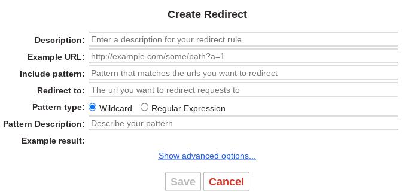

# Set up a temporary localhost redirector

Follow the instructions in this document if you are working through [exercise 01](exercises/01-set-up-workspace/) and have decided to use a Dev Space in the SAP Business Application Studio as your working environment.

> This is a completely optional step, to allow you to follow `http://localhost:4004` style links in this CodeJam material, even if your CAP server is not actually available at that location.

## Install the Redirector extension

👉 Head over to the [Redirector extension in the Chrome Web store](https://chrome.google.com/webstore/detail/redirector/ocgpenflpmgnfapjedencafcfakcekcd?hl=en) and select "Add to Chrome".

## Work out what your Dev Space port availability URLs look like

👉 In your new Dev Space, open a new terminal (menu path `Terminal -> New Terminal`) and run a simple test HTTP server on port 4004 to trigger the SAP Business Application Studio's port forwarding infrastructure, so you can open a new browser tab to see what the URL looks like for your Dev Space:

```bash
python3 -mhttp.server 4004
```

This should produce a log line like this:

```text
Serving HTTP on 0.0.0.0 port 4004 (http://0.0.0.0:4004/) ...
```

More importantly, you should also then see a popup that looks like this:


Choose "Open in a New Tab" and take a note of the URL, which should be variable in three areas:

* the workspace ID
* whether you're running in a trial account
* the region

Here's an example of a URL from a trial account based Dev Space (note the extra `.trial` in the fully qualified hostname part):

```text
https://port4004-workspaces-ws-sd4hv.us10.trial.applicationstudio.cloud.sap/
```

Here's an example of a URL from a non-trial account based Dev Space:

```text
https://port4004-workspaces-ws-h2g2z.eu10.applicationstudio.cloud.sap/
```

> In case you're wondering what's being served, it's a simple listing of the contents of the directory where the Python HTTP server is running.

## Create a rule in the Redirector

👉 Open the Redirector configuration, which should look something like this (you may need to choose the "Create new redirect" button first):



👉 Create a new redirect entry, filling in the fields as follows:

|Field|Value|
|-|-|
|Description|SAP CodeJam on CAP Service Integration|
|Example URL|`http://localhost:4004`|
|Include Pattern|`http://localhost:(4004\|4005)(.*)`|
|Redirect To|`https://port$1-workspaces-ws-xxxxx.yyyy.zzzzz.applicationstudio.cloud.sap$2` <br>where `xxxxx` and `yyyy` are specific to your URLs that you see<br>and where you may or may not have the `.zzzzz` part i.e. `.trial`|
|Pattern type|Regular Expression|
|Pattern Description|Localhost to Dev Space service|

👉 Save the redirect once you've completed the entries.

👉 Now, to test, try selecting this link: <http://localhost:4004>. If the redirect entry has been configured successfully, you should be taken to the corresponding URL served from your Dev Space, and see the directory listing as before.

That's it!

👉 Once you're satisfied that the redirects are working as required, you can stop the test HTTP server with Ctrl-C (also depicted as `^C`). You'll see something like this:

```console
user: cap-service-integration-codejam $ python3 -mhttp.server 4004
Serving HTTP on 0.0.0.0 port 4004 (http://0.0.0.0:4004/) ...
127.0.0.1 - - [10/May/2023 06:06:03] "GET / HTTP/1.1" 200 -
^C
Keyboard interrupt received, exiting.
```

## Removing the rule and / or extension

Once the CodeJam is over, you can remove the rule or even the entire extension; it's only there to make it easier for you to follow `localhost` URLs in the material and be taken to the right location served up by your specific Dev Space.
